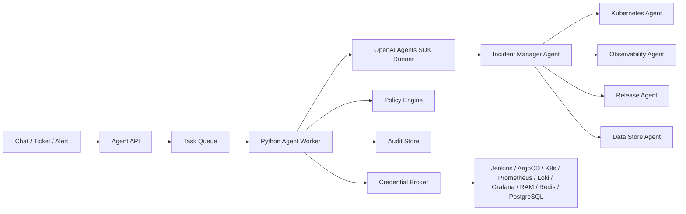

# 第 15 章：Python OpenAI SDK / OpenAI Agents SDK DevOps 落地方案

> 从 Hermes 专项方案中拆出的 Python 服务化落地路线：使用 Python 构建内部 Agent 服务，通过 typed tools、handoff、guardrail、trace、session 和 MCP 实现可治理的运维自动化。

---

## 文档目的

本文聚焦直接使用 Python + OpenAI SDK / OpenAI Agents SDK 构建内部 DevOps Agent 服务。它不替代 Hermes Agent 专项方案，而是作为长期平台化路线：当团队需要完全掌控 API、持久状态、测试体系、审批链路、审计存储、租户隔离和多入口接入时，采用该路线。

共享的 skills 分层、MCP/RBAC、GitOps、审计和高风险操作边界，见 [第 14 章：Hermes Agent DevOps 落地方案](./14-hermes-agent-devops-implementation.md)。

---

## 基于 Python OpenAI Agents SDK 落地

当团队需要产品化内部服务、可控 API、typed tools、测试套件、持久 workflow 和明确部署所有权时，Python 路线更合适。

### 服务架构



### Python 项目结构

```text
devops_agent/
  pyproject.toml
  skills/
    catalog_loader.py
    registry.py
    runner.py
  src/devops_agent/
    app.py
    config.py
    context.py
    agents/
      incident_manager.py
      kubernetes_agent.py
      observability_agent.py
      release_agent.py
      datastore_agent.py
    tools/
      prometheus.py
      loki.py
      kubernetes.py
      argocd.py
      jenkins.py
      alicloud.py
      redis_tools.py
      postgres_tools.py
    policy/
      decision.py
      rules.py
      approvals.py
    credentials/
      broker.py
    audit/
      trail.py
    workflows/
      incident.py
      release.py
      gitops_change.py
  tests/
    test_skill_metadata_contract.py
    test_skill_runner.py
    test_policy.py
    test_prometheus_tool.py
    test_kubernetes_tool.py
    test_incident_trajectory.py
```

### 策略与审计基础

```python
from __future__ import annotations

from dataclasses import dataclass, field
from enum import Enum
from time import time
from typing import Any
from uuid import uuid4


class Environment(str, Enum):
    DEV = "dev"
    TEST = "test"
    STAGING = "staging"
    PROD = "prod"


class Decision(str, Enum):
    ALLOW = "allow"
    DENY = "deny"
    REQUIRE_APPROVAL = "require_approval"


@dataclass(frozen=True)
class ToolRequest:
    user_id: str
    user_role: str
    service: str
    environment: Environment
    tool: str
    action: str
    resource: str
    correlation_id: str
    metadata: dict[str, Any] = field(default_factory=dict)


@dataclass(frozen=True)
class PolicyDecision:
    decision: Decision
    reason: str
    required_approvers: tuple[str, ...] = ()
    max_ttl_seconds: int = 0


def evaluate_policy(req: ToolRequest) -> PolicyDecision:
    destructive = {"delete", "drop", "flush", "failover", "scale_to_zero"}
    prod_mutation = req.environment == Environment.PROD and req.action != "read"

    if req.action in destructive:
        return PolicyDecision(
            Decision.REQUIRE_APPROVAL,
            "Destructive operation requires named SRE and service-owner approval.",
            ("sre-oncall", "service-owner"),
            300,
        )

    if prod_mutation:
        return PolicyDecision(
            Decision.REQUIRE_APPROVAL,
            "Production mutation requires change ticket and human approval.",
            ("sre-oncall",),
            600,
        )

    if req.user_role == "developer" and req.environment == Environment.PROD:
        return PolicyDecision(Decision.DENY, "Developers have no direct production tool execution.")

    return PolicyDecision(Decision.ALLOW, "Allowed by role, environment, and action policy.", max_ttl_seconds=900)


def audit_event(event_type: str, req: ToolRequest, result: dict[str, Any]) -> dict[str, Any]:
    return {
        "id": str(uuid4()),
        "ts": time(),
        "type": event_type,
        "correlation_id": req.correlation_id,
        "user_id": req.user_id,
        "service": req.service,
        "environment": req.environment.value,
        "tool": req.tool,
        "action": req.action,
        "resource": req.resource,
        "result": result,
    }
```

### Typed Prometheus tool

```python
from __future__ import annotations

import httpx
from pydantic import BaseModel


class PrometheusQueryResult(BaseModel):
    status: str
    query: str
    result_type: str
    result: list[dict]


class PrometheusClient:
    def __init__(self, base_url: str, token: str, timeout_seconds: float = 8.0) -> None:
        self.base_url = base_url.rstrip("/")
        self.timeout = timeout_seconds
        self.headers = {"Authorization": f"Bearer {token}"}

    async def instant_query(self, query: str, *, timeout: str = "5s") -> PrometheusQueryResult:
        if len(query) > 500:
            raise ValueError("PromQL query is too long for agent execution")
        if any(blocked in query.lower() for blocked in ["drop_common_labels", "label_replace"]):
            raise ValueError("PromQL query uses a blocked high-risk function")

        async with httpx.AsyncClient(timeout=self.timeout) as client:
            response = await client.get(
                f"{self.base_url}/api/v1/query",
                params={"query": query, "timeout": timeout},
                headers=self.headers,
            )
            response.raise_for_status()
            payload = response.json()

        data = payload["data"]
        return PrometheusQueryResult(
            status=payload["status"],
            query=query,
            result_type=data["resultType"],
            result=data["result"],
        )
```

### Kubernetes 只读 tool

```python
from __future__ import annotations

from kubernetes_asyncio import client, config
from pydantic import BaseModel


class PodSummary(BaseModel):
    name: str
    phase: str | None
    ready: bool
    restarts: int


async def list_service_pods(namespace: str, selector: str) -> list[PodSummary]:
    if namespace in {"kube-system", "argocd"}:
        raise ValueError("system namespaces are not available to this read-only tool")

    await config.load_incluster_config()
    core = client.CoreV1Api()
    pods = await core.list_namespaced_pod(namespace=namespace, label_selector=selector)

    summaries: list[PodSummary] = []
    for pod in pods.items:
        statuses = pod.status.container_statuses or []
        summaries.append(
            PodSummary(
                name=pod.metadata.name,
                phase=pod.status.phase,
                ready=all(status.ready for status in statuses) if statuses else False,
                restarts=sum(status.restart_count for status in statuses),
            )
        )
    return summaries
```

### OpenAI Agents SDK 编排

```python
from __future__ import annotations

from agents import Agent, Runner, function_tool


@function_tool
async def get_gateway_error_rate(service: str, environment: str) -> dict:
    """Return the five-minute HTTP 5xx rate for one approved service/environment."""
    query = (
        f'sum(rate(http_requests_total{{service="{service}",env="{environment}",status=~"5.."}}[5m]))'
    )
    return {"query": query, "value": 0.03, "unit": "requests_per_second"}


@function_tool
async def get_recent_deployments(service: str, environment: str) -> list[dict]:
    """Return recent Jenkins/ArgoCD deployment events for one service/environment."""
    return [
        {"source": "argocd", "revision": "a1b2c3d", "finished_at": "2026-06-06T09:12:00+08:00"},
    ]


observability_agent = Agent(
    name="Observability Agent",
    instructions=(
        "Use metrics and logs to establish symptoms, time range, and blast radius. "
        "Do not recommend mutation. Return evidence and confidence."
    ),
    tools=[get_gateway_error_rate],
)

release_agent = Agent(
    name="Release Agent",
    instructions=(
        "Analyze deployment history and CI/CD evidence. "
        "Do not trigger builds or syncs unless policy-approved tools are provided."
    ),
    tools=[get_recent_deployments],
)

incident_manager = Agent(
    name="Incident Manager",
    instructions=(
        "Coordinate DevOps incident diagnosis. Call specialists as tools, compare evidence, "
        "and produce a safe next action. Production mutation requires approval."
    ),
    tools=[
        observability_agent.as_tool(
            tool_name="observability_analysis",
            tool_description="Analyze Prometheus/Loki/Grafana evidence.",
        ),
        release_agent.as_tool(
            tool_name="release_analysis",
            tool_description="Analyze Jenkins and ArgoCD deployment evidence.",
        ),
    ],
)


async def run_incident(question: str) -> str:
    result = await Runner.run(incident_manager, question)
    return result.final_output
```

这个 SDK 示例刻意不把生产权限写进 Agent instructions。真实 tools 在触达外部系统前，必须先经过 policy check、audit event 和 credential broker。

### 直接使用 OpenAI SDK 的边界

当 workflow 足够窄、应用本身希望掌控编排循环时，可以直接使用 OpenAI Python SDK。OpenAI 官方文档描述的 Responses API 支持 function tools 和多步骤 tool-calling：应用把可用 tools 发送给模型，接收 tool call，在应用代码中执行工具，把 tool output 返回给模型，再请求最终回答。

在本方案中，直接 OpenAI SDK 适用于：

- Hermes 或 Python agent service 之前的意图分类；
- tools 已经收集完证据后的报告生成；
- 单步只读 tools，并且产品代码要完全掌控 retry、state、policy 和 audit；
- 团队还没准备好采用 agent framework，但希望先使用 function calling。

它不适合作为复杂故障编排的主层，因为复杂故障往往需要多个 specialist、handoff、session 和长生命周期 state。这类场景应优先使用 Agents SDK。

```python
from __future__ import annotations

import json
from openai import OpenAI


client = OpenAI()

tools = [
    {
        "type": "function",
        "name": "get_service_health",
        "description": "Return approved read-only health evidence for one service and environment.",
        "parameters": {
            "type": "object",
            "properties": {
                "service": {"type": "string"},
                "environment": {"type": "string", "enum": ["dev", "test", "staging", "prod"]},
            },
            "required": ["service", "environment"],
            "additionalProperties": False,
        },
        "strict": True,
    }
]


def get_service_health(service: str, environment: str) -> dict:
    request = ToolRequest(
        user_id="u-123",
        user_role="developer",
        service=service,
        environment=Environment(environment),
        tool="get_service_health",
        action="read",
        resource=f"{environment}/{service}",
        correlation_id="corr-20260606-direct-sdk",
    )
    decision = evaluate_policy(request)
    if decision.decision == Decision.DENY:
        return {"status": "denied", "reason": decision.reason}
    return {"status": "ok", "service": service, "environment": environment, "error_rate_5m": 0.01}


def answer_health_question(question: str) -> str:
    response = client.responses.create(
        model="gpt-5",
        instructions="Answer with evidence from approved tools. Do not invent live system state.",
        tools=tools,
        input=question,
    )

    followup_input = list(response.output)
    for item in response.output:
        if item.type == "function_call" and item.name == "get_service_health":
            args = json.loads(item.arguments)
            output = get_service_health(args["service"], args["environment"])
            followup_input.append(
                {
                    "type": "function_call_output",
                    "call_id": item.call_id,
                    "output": json.dumps(output, ensure_ascii=False),
                }
            )

    final = client.responses.create(
        model="gpt-5",
        instructions="Summarize only the returned tool evidence and any policy denial.",
        tools=tools,
        input=followup_input,
    )
    return final.output_text
```

### 何时优先选择 Python OpenAI Agents SDK

适合选择该路线的场景：

- 组织希望建设长期运行的内部平台，而不是一个工作站/profile 包；
- DevOps 动作需要强单元测试、轨迹测试、审批和服务级 SLO；
- 每次 tool call 前都必须通过代码强制执行策略；
- 需要多个前端：聊天、工单、API、告警 webhook、定时任务；
- 团队需要直接拥有 persistence、tenancy、audit storage、credential brokerage 和 rollout。

---

---

## 与 Hermes 方案的边界

Python 服务化路线负责长期平台能力：API、多租户、强测试、持久 session、审批状态机、审计存储、credential broker 和多前端接入。Hermes 路线负责先落地可用的 profile、skill、gateway、messaging 和 MCP 工作台。

两条路线应共享同一份 `devops-agent-skills/` catalog，不应各自维护一套 workflow。
