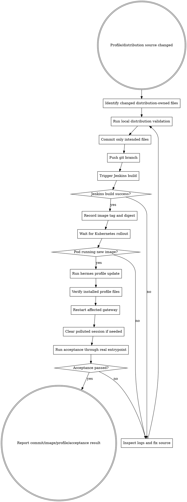

# Hermes Profile Change Delivery

这个 skill 用于“修改 Hermes Agent profile/distribution 后怎么交付”。它不是业务服务目录，不负责回答业务问题。
当变更涉及 `SOUL.md`、`skills/`、`config.yaml`、`mcp.json`、`cron/` 等 distribution-owned 文件时，必须走完整闭环。

## Delivery Flow



## Required Commands

Local validation before commit:

```bash
python3 distributions/orchestrator/tests/validate_distribution.py
git diff --check -- distributions/orchestrator
```

Kubernetes delivery checks after Jenkins:

```bash
kubectl get pod hermes-agent-0 -n yuexin-ai -o jsonpath='{.spec.containers[0].image}{"\n"}{.status.containerStatuses[0].imageID}{"\n"}'
kubectl exec -n yuexin-ai hermes-agent-0 -- sh -lc 'cd /opt/hermes && /opt/hermes/.venv/bin/hermes profile update orchestrator --yes'
kubectl exec -n yuexin-ai hermes-agent-0 -- sh -lc 'grep -n "<expected text>" /opt/data/profiles/orchestrator/SOUL.md'
kubectl exec -n yuexin-ai hermes-agent-0 -- sh -lc '/package/admin/s6/command/s6-svc -t /run/service/gateway-orchestrator'
```

Hermes native profile checks:

```bash
/opt/hermes/.venv/bin/hermes profile info orchestrator
/opt/hermes/.venv/bin/hermes -p orchestrator skills list --enabled-only
/opt/hermes/.venv/bin/hermes -p orchestrator sessions list
/opt/hermes/.venv/bin/hermes -p orchestrator sessions delete <session_id> --yes
```

## Acceptance Rule

验收必须走真实失败入口。飞书入口问题必须通过飞书消息或飞书 gateway 日志验证，不能只看文件已经更新。

验收输出必须包含：

- Git commit id
- Jenkins build number
- Image tag and digest
- Kubernetes pod image
- `hermes profile update` result
- Gateway restart evidence
- Real entrypoint acceptance result
- Remaining risk or next fix
