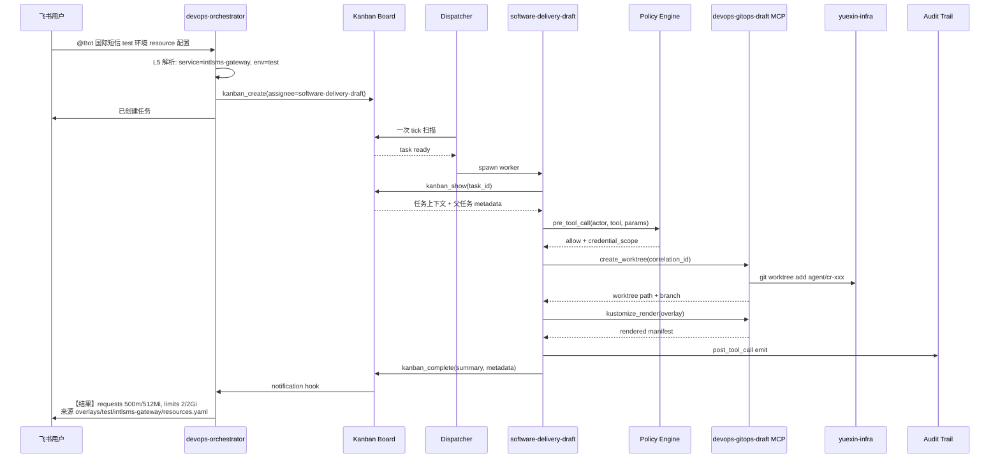

# Hermes DevOps Agent

---

## 全局视图

Hermes DevOps Agent 不是"加了运维工具的 Chatbot"，而是一个**把不可信的模型输出和高权限基础设施操作隔离开**的分布式系统。它的核心问题不是"模型能不能写脚本"，而是"出错时谁来兜底"。

整个系统拆成**六个互相协作但职责正交的平面**，每个平面有自己的强制层和失败模式：

```text
┌─────────────────────────────────────────────────────────────┐
│                   1. 入口层(Ingestion)                       │
│  飞书 ChatOps │ Webhook │ Schedules │ Alert │ Ticket / API   │
│  ChatOps → orchestrator;其他事件源 → 目标领域 profile        │
└────────────────────────────┬────────────────────────────────┘
                             │
┌────────────────────────────▼────────────────────────────────┐
│                   2. 路由调度(Routing)                       │
│  ChatOps:Orchestrator → Kanban Board → Dispatcher            │
│  事件驱动:直接进入领域 profile gateway,不经 Board            │
└────────────────────────────┬────────────────────────────────┘
                             │
┌────────────────────────────▼────────────────────────────────┐
│                3. Profile 运行时(Runtime)                    │
│  Distribution → Profile(config + SOUL + .env + workspace)    │
│  + Plugin(hooks / custom tools / slash commands)             │
│  隔离:入口、凭证、tools、MCP scope、memory、session          │
└────────────────────────────┬────────────────────────────────┘
                             │
┌────────────────────────────▼────────────────────────────────┐
│                 4. 能力分层(Capability)                      │
│  L5 Entry Skill (请求标准化)                                 │
│  L3 Orchestration Skill (场景流程编排)                       │
│  Subagents (领域隔离执行,delegate_task)                      │
│  L2 Functional Skill (单一运维能力)                          │
└────────────────────────────┬────────────────────────────────┘
                             │
┌────────────────────────────▼────────────────────────────────┐
│                5. 工具集成(Integration)                      │
│  L1 MCP Safe Wrappers (typed tools + schema + audit)         │
│  Hermes Tools / MCP Servers                                  │
│  Credential Broker (短 TTL 凭证) + Git Worktree 池           │
│  L0 Basics (CLI / DSL / 配置规范)                            │
└────────────────────────────┬────────────────────────────────┘
                             │  ← 6 横切所有层
┌────────────────────────────▼────────────────────────────────┐
│                6. 治理与观测(Governance)                     │
│  Policy Hook │ Audit Trail │ Redaction                       │
│  Approval │ Break-glass │ Tier 0-4 自治分级                  │
│  DevOps Plugin (pre_tool_call / post_tool_call 等 hook)      │
└─────────────────────────────────────────────────────────────┘
```

- **1 → 5**：请求处理主链。每一步都是上一步的下游，职责正交。
- **6 横切 1-5**：治理与观测不是某一层的能力，而是每次 tool call 必经的关卡。

接下来按平面拆解。

---

## Plane 1: 入口层

外部事件如何进入系统。**不同信号源走不同接入路径**——飞书 ChatOps 经 orchestrator 统一路由，事件驱动信号（告警、Webhook、定时任务、工单）直接进入目标领域 profile，无需绕路。

| Signal Source | 接入 Profile | Example | Trigger Type |
|---|---|---|---|
| 飞书 ChatOps | `devops-orchestrator`（唯一需要意图解析的入口） | `@Bot 国际短信测试环境的 resource 配置是多少` | Interactive |
| Webhook | 目标领域 profile（按 webhook 来源） | Codeup MR opened、Jenkins build done | Event-driven |
| Schedules | 目标领域 profile | 每日 GitOps drift scan、巡检 | Time-driven |
| Alert Event | `observability`（直挂 webhook gateway） | Alertmanager / Grafana / 云监控 | Reactive |
| Ticket / API | 目标领域 profile | 工单系统、CI/CD 流水线触发 | Programmatic |


---

## Plane 2: 路由调度

两条入口路径架构上**独立**——Kanban 只服务于 ChatOps 跨 profile 路由，事件驱动信号直接由领域 profile 自治消化，不绕 Board。

```text
飞书 ChatOps           ──→  devops-orchestrator Gateway
                              │（解析意图 → 创建 Kanban 任务）
                              ▼
                          Kanban Board  ──→  Worker spawn
                                            （跨 profile 路由）

告警 / Webhook /        ──→  领域 profile gateway  ──→  profile 内部直接执行
定时任务 / Ticket          （结构化上下文，自治完成，不经 Board）
```

**两条路径的分工**：
- **ChatOps 路径（经 Kanban）**：自然语言 → orchestrator 解析意图 → `kanban_create(assignee=...)` → dispatcher spawn 目标 profile worker → `kanban_complete` → 回传飞书。Kanban 在这里解决"自然语言意图 → 哪个 profile 处理"的路由问题。
- **事件驱动路径（不经 Kanban）**：告警 / Webhook / Cron / Ticket → 领域 profile 自有 gateway → profile 内部完整执行 → 结果回传飞书 / 工单。信号已经路由到目的地，无需再绕 Board。

两条路径独立运行，但共用同一份 plugin 审计 hook，所有 tool call 都写入同一份 action trail。


### **ChatOps 路径（用户提供的例子）**

```text
  飞书群 @Bot → devops-orchestrator Gateway
    → orchestrator 解析意图（需要 LLM 解析自然语言）
    → kanban_create(assignee=software-delivery-draft, ...)
    → 飞书回复"已创建任务 #N"

  Dispatcher (15s tick) spawn software-delivery-draft:
    → kanban_show() 读取任务上下文
    → ...执行...
    → kanban_complete(summary, metadata)

  Gateway notification → 飞书群回传结果

  特征：异步、跨进程、有 15s 调度延迟、有 task 持久化、跨 profile 路由。
```

---

### 告警路径（事件驱动）

```text
Alertmanager webhook → observability profile 的 webhook gateway
  → L5 alert-entry 解析（结构化 JSON,无需 LLM）:
        alert_name=IntlsmsHighErrorRate
        service=intlsms-gateway, env=prod
        severity=P1, error_rate=45%, window=5m
  → L4 skill-policy-gate 校验:
        actor=alertmanager(system), scope=observe → allow
  → L3 alert-triage-orchestration（profile 内部，同一进程）:
        ├─ prometheus_query(error_rate by route, 30m)
        ├─ loki_query("level=error", intlsms-gateway, 30m)
        └─ argocd_get_recent_syncs(intlsms-gateway, 1h)
  → L2 observability-health-query 聚合:
        503 突增,集中在 send_sms_v2 路由
        5min 前 ArgoCD sync 引入新版本
  → L4 audit-trail 写入:
        correlation_id=alert_01HX..., result=success

profile 直接调用飞书 API → 故障群:
  "【P1】intlsms-gateway prod 错误率 45%
   疑似 5min 前 ArgoCD sync(send_sms_v2)引入
   证据 [audit_01HX...]"


```

特征：同步、单进程、亚秒延迟、无 task 持久化、profile 内自治。

### Orchestrator 的硬约束

**Orchestrator 是纯路由层**，遵循 `decompose, route, summarize — never execute`：

```yaml
# orchestrator config.yaml
kanban:
  dispatch_in_gateway: true
  dispatch_interval_seconds: 15
  max_in_progress_per_profile: 3
  failure_limit: 2
  auto_promote_children: true

custom_toolsets:
  orchestrator:
    - kanban
    - skills
    - memory
  # 不含 terminal / file / web / MCP 生产工具
```

---

## Plane 3: **Agent Runtime**

Profile 是**运行时状态隔离层**，不是安全沙箱。每个 profile 有独立 `HERMES_HOME`、`.env`、`SOUL`、`workspace`、`tool/MCP scope`。

```text
┌─────────────────────────────────────────────────────┐
│  Distribution  (Git 仓库交付包)                       │
│    distribution.yaml · SOUL.md · config.yaml         │
│    skills/ · cron/ · mcp.json                         │
│    交付完整 Agent，1:1 对应一个 profile               │
└──────────────────────┬──────────────────────────────┘
                       │ hermes profile install
                       ▼
┌─────────────────────────────────────────────────────┐
│  Profile  (运行时实例)                                │
│    gateway · workspace · credentials                │
│    skills  · MCP scope · memory/session             │
└──────────────────────┬──────────────────────────────┘
                       │ plugins.enabled
                       ▼
┌─────────────────────────────────────────────────────┐
│  Plugin  (能力扩展层)                                  │
│    custom tools · hooks · slash commands             │
│    pre_tool_call · post_tool_call · pre_gateway     │
└─────────────────────────────────────────────────────┘
```


###  profile + subagent的组合架构

1. devops-orchestrator

```
  Profile: devops-orchestrator
    ├── agentic-intent-parser
    │     └── 解析飞书自然语言：actor / service / env / request_type
    ├── agentic-task-router
    │     └── 选择目标 profile 并 kanban_create
    └── agentic-result-summarizer
          └── 汇总 worker 输出并回传飞书 / 故障群
```

2. infra-agent

```
  Profile: infra-agent
    ├── alicloud-analyst
    │     └── 阿里云 ECS / RDS / VPC / OSS / RAM 资源、容量、配额巡检
    ├── kubernetes-cluster-analyst
    │     └── ACK / K8s 集群、Pod、Service、Ingress 状态查询与诊断
    ├── network-analyst
    │     └── VPC / SLB / CEN / DNS 网络拓扑与连通性查询
    ├── alicloud-security-analyst
    │     └── RAM 权限、ActionTrail、暴露面合规检查
    └── alicloud-cost-analyst
          └── 成本分析、闲置资源识别、规格优化建议
```

3. CI/CD Pipeline

```
  Profile: gitops-agent
    ├── jenkins-pipeline
    │     └── Jenkins job / build / shared-library 查询与修改草稿
    ├── argocd
    │     └── ArgoCD app / sync / rollback 状态与已审批操作
    └── gitops
          └── Kustomize / Helm overlay 定位、render、base 与 overlay 对比
```

  4. observability 

```
  Profile: observability
    ├── prometheus-metrics-query
    │     └── Prometheus 指标查询、SLO 评估、告警来源溯源
    ├── loki-logs-query
    │     └── Loki 日志聚类、错误模式识别、关联分析
    ├── grafana
    │     └── Grafana dashboard、告警规则定位与可视化查询
    └── alert-router
          └── Alertmanager / Grafana / 云监控 webhook 接入、去重、聚合、补充上下文
```

---

## Plane 4: **Tools, CLIs & Skills**

skills分层模型

```text
  ┌──────────────────────────────────────────────────────────────────────┐
  │ L3  Entry Skills          请求标准化(actor / service / env / route)   │
  │        e.g.  chat-ops-entry · alert-entry · webhook-entry             │
  │ ───────────────────────────────────────────────────────────────────── │
  │ L2  Orchestration         场景编排:选 L1、委派 subagent                │
  │        e.g.  intlsms-runtime-inspection · gitops-change-flow          │
  │ ───────────────────────────────────────────────────────────────────── │
  │ L1  Functional Skills     单一运维能力(诊断 / 查询 / 定位)                │
  │        e.g.  loki-logs-query · kubernetes-debug                       │
  │ ───────────────────────────────────────────────────────────────────── │
  │ L0  Basics                CLI / DSL / 配置语法                         │
  │        e.g.  promql-basics · kubectl-basics · loki-logql-basics       │
  └──────────────────────────────────────────────────────────────────────┘
```

例 B：查询国际短信测试环境gateway服务过去30分钟的错误日志

```
【输入】 { service: intlsms-gateway, env: test, request_type: error_rate_query, window: 5m }

【调用链路】(直线,展示 L3 → L2 → L1 → L0 分层)

  step 1  L3 chat-ops-entry              [入口标准化]
            └─ 解析飞书自然语言:
               "查国际短信 test 环境过去 5min 错误率"
            └─ 输出: { service, env, request_type, window }

  step 2  L2 intlsms-runtime-inspection  [场景编排]
            └─ 决定调用 L1 prometheus-metrics-query
               (本场景仅需指标查询,无需 logs / k8s,直线编排)

  step 3  L1 prometheus-metrics-query    [功能查询]
            └─ 构造 PromQL,调用 MCP tool prometheus_query_range
            └─ 引用 L0 获取 PromQL 语法规范

  step 4  L0 promql-basics               [基础语法]
            └─ 提供 PromQL 模板:
               rate(http_requests_total{service="$svc",env="$env",status=~"5.."}[5m])
               /
               rate(http_requests_total{service="$svc",env="$env"}[5m])
            └─ 纯知识层,不产生 tool call,只被 L1 引用


  【输出】(回传给 L3 / kanban_complete)
    { error_rate: 6.2%,
      window:     "过去 5min",
      query:      "rate(http_requests_total{...}[5m]) / ..." }
```


---

## Plane 5: MCP

模型不直接持有凭证、不接触原始 shell、不写共享 checkout。所有外部副作用通过**三个隔离层**进入真实系统。

| 优先级 | MCP Server          | 主要能力                                     | 风险等级 |
| ------ | ------------------- | -------------------------------------------- | -------- |
| P0     | Kubernetes MCP      | 查询 Pod、Deployment、Node、Event、Namespace | L0-L2    |
| P0     | Prometheus MCP      | 查询指标、告警、SLO、时间序列                | L0       |
| P0     | Loki / 日志 MCP     | 查询错误日志、按 Trace / Pod / 服务过滤      | L0       |
| P0     | ArgoCD MCP          | 查询应用同步状态、Diff、历史版本、回滚建议   | L0-L2    |
| P1     | Jenkins MCP         | 查询构建记录、失败日志、流水线状态           | L0-L1    |
| P1     | Git / Codeup MCP    | 查询提交、分支、配置差异、变更历史           | L0       |
| P1     | 云厂商 MCP          | 查询 ECS、SLB、ACK、RDS、账单、资源状态      | L0-L2    |
| P1     | CMDB / 服务目录 MCP | 查询服务负责人、依赖、环境、SLA              | L0       |
| P1     | 工单 / 审批 MCP     | 创建变更单、查询审批状态、记录执行结果       | L1-L2    |

根据不同的环境注册程度MCP格式如下：

```
prometheus-intlsms-prod
prometheus-intlsms-test
loki-intlsms-prod
loki-intlsms-test
k8s-intlsms-prod
k8s-intlsms-test
```

**Tool 命名规则**：Hermes 运行时把 MCP tool 注册为 `mcp_<server>_<tool>`（dashes→underscores）。

```yaml
# observability-query profile config.yaml
mcp_servers:
  k8s-intlsms-test:
    command: "python3"
    args: ["mcp-servers/k8s/server.py"]
    tools:
      include:
        - k8s_readonly_get_workload

```

## 6. Plugin 体系：不改 core 的能力扩展

### 6.1 Plugin 职责

当前 `plugins/devops_agent/` 已不再只是预留目录。仓库中已有 `plugin.yaml`、`__init__.py`、`policy.py`、`audit.py`、`redaction.py`、`guardrails.py`、`kanban_reply.py` 和 `commands.py`。`plugin.yaml` 版本为 `0.4.0`，声明了 NeMo Guardrails input rail、policy gate、audit trail、secret redaction、Kanban 到飞书回传订阅、治理工具、slash commands 和 CLI command。

注册面以 `plugins/devops_agent/__init__.py` 为准：

```python
def register(ctx):
    ctx.register_hook("pre_gateway_dispatch",  _guardrails.pre_gateway_dispatch)
    ctx.register_hook("pre_tool_call",         _pre_tool_call)
    ctx.register_hook("post_tool_call",        _post_tool_call)
    ctx.register_hook("transform_tool_result", _transform_tool_result)

    ctx.register_tool("devops_policy_decide", toolset="devops_governance", ...)
    ctx.register_tool("devops_audit_emit",    toolset="devops_governance", ...)

    ctx.register_command("devops_status", ...)
    ctx.register_command("devops_audit", ...)
    ctx.register_cli_command(name="devops", ...)
```

### 6.2 Plugin 能力清单

| 能力 | 当前实现文件 | 作用 | 当前状态 |
|---|---|---|---|
| Input rail | `guardrails.py` + `pre_gateway_dispatch` | 飞书消息进入 worker 前做 jailbreak / prompt injection 初筛 | 已有代码，需运行时联调 |
| Policy gate | `policy.py` + `pre_tool_call` | 对工具名中的生产写模式进行拦截；非 `governance-breakglass` profile 不允许调用匹配的生产写工具 | 已有代码，需验证 hook 阻断语义 |
| Audit trail | `audit.py` + `post_tool_call` | 写结构化 action trail | 已有代码，需验证运行时日志路径和回放 |
| Redaction | `redaction.py` + `transform_tool_result` | 脱敏 tool output，防止 secret 进入模型上下文 | 已有代码，需补样例测试 |
| Kanban 回传订阅 | `kanban_reply.py` + `post_tool_call(kanban_create)` | 解析 task body 中的 `reply_target`，写入 Kanban notify subscription | 已有代码，需飞书端 smoke |
| Governance tools | `devops_policy_decide`、`devops_audit_emit` | 显式策略检查和手工审计事件 | 已注册 |
| Slash / CLI | `commands.py` | `/devops_status`、`/devops_audit`、`hermes devops ...` | 已有代码，需本机 CLI 验证 |

### 6.3 硬性约束

**插件不得修改 Hermes core**。如果框架能力不足，先新增通用 plugin surface，再让 DevOps plugin 使用该 surface。

---


## Putting It Together: End-to-End Flow

**以下展示 ChatOps 路径**：飞书查询 → Orchestrator 路由 → Kanban 分派 → Worker 执行 → 结果回传。事件驱动路径（告警 / Webhook / Cron / Ticket）不走这条链——由领域 profile gateway 直接消化，参见 Plane 1 / Plane 2。



### 时序关键点

- **L5 不切换 profile**——只输出标准化请求结构。
- **Worker spawn 后才进入 policy gate**——orchestrator 不持有任何 MCP 生产工具。
- **每个 tool call 都经过 pre/post hook**——审计闭环必须能不读聊天记录还原 run。
- **事件驱动信号不走这条链**——告警 / Webhook / Cron / Ticket 直接进入领域 profile gateway，policy gate / MCP call / audit emit 全部在 profile 内部完成，结果回传飞书 / 工单。
- **生产紧急动作也不走这条链**——走独立 `governance-breakglass` Gateway，独立飞书 Bot + 独立凭证。

---

