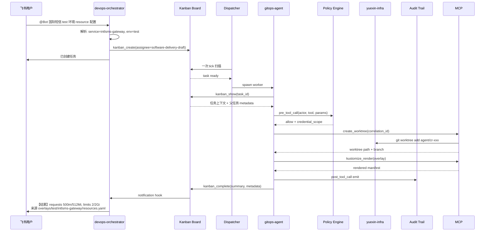

# Hermes DevOps Agent

---

## 全局视图


本方案以 Hermes Agent 作为运维助手的运行底座。飞书 ChatOps 通过 Gateway 接入，告警、Webhook、Schedules 和工单事件按来源进入对应 profile(Agent)。把运维需要的能力统一收敛到 Hermes 的 Gateway、Profile、Skills、Tools、MCP 和 Hooks 体系内。

整个系统拆成**六个互相协作但职责正交的平面**，每个平面有自己的强制层和失败模式：

```text
┌─────────────────────────────────────────────────────────────┐
│                   1. 入口层(Ingestion)                       │
│  飞书 ChatOps │ Webhook │ Schedules │ Alert │ Ticket / API   │
│  ChatOps → orchestrator;其他事件源 → 目标领域 profile        │
└────────────────────────────┬────────────────────────────────┘
                             │
┌────────────────────────────▼────────────────────────────────┐
│                   2. 路由调度(Routing)                       │
│  ChatOps:Orchestrator → Kanban Board → Dispatcher            │
│  事件驱动:直接进入领域 profile gateway,不经 Board            │
└────────────────────────────┬────────────────────────────────┘
                             │
┌────────────────────────────▼────────────────────────────────┐
│                3. Profile 运行时(Runtime)                    │
│  Distribution → Profile(config + SOUL + .env + workspace)    │
│  + Plugin(hooks / custom tools / slash commands)             │
│  隔离:入口、凭证、tools、MCP scope、memory、session          │
└────────────────────────────┬────────────────────────────────┘
                             │
┌────────────────────────────▼────────────────────────────────┐
│                 4. 能力体系(Capability)                      │
│  Skills: assets / workflows / basics                        │
│  Subagent Delegation (profile 内临时并行执行,delegate_task)  │
└────────────────────────────┬────────────────────────────────┘
                             │
┌────────────────────────────▼────────────────────────────────┐
│                5. 工具集成(Integration)                      │
│  Hermes Tools / MCP Servers                                  │
│  CLI / DSL / 配置规范由 basics skills 提供                    │
└────────────────────────────┬────────────────────────────────┘
                             │  ← 6 横切所有层
┌────────────────────────────▼────────────────────────────────┐
│                6. 治理与观测(Governance)                     │
│  Policy Hook │ Audit Trail │ Redaction                       │
│  Approval │ Break-glass │ Tier 0-4 自治分级                  │
│  DevOps Plugin (pre_tool_call / post_tool_call 等 hook)      │
└─────────────────────────────────────────────────────────────┘
```

- **1 → 5**：请求处理主链。每一步都是上一步的下游，职责正交。
- **6 横切 1-5**：治理与观测不是某一层的能力，而是每次 tool call 必经的关卡。

接下来按平面拆解。

---

## Plane 1: 入口层

外部事件如何进入系统。**不同信号源走不同接入路径**——飞书 ChatOps 经 orchestrator 统一路由，事件驱动信号（告警、Webhook、定时任务、工单）直接进入目标领域 profile，无需绕路。

| Signal Source | 接入 Profile | Example | Trigger Type |
|---|---|---|---|
| 飞书 ChatOps | `devops-orchestrator`（唯一需要意图解析的入口） | `@Bot 国际短信测试环境的 resource 配置是多少` | Interactive |
| Webhook | 目标领域 profile（按 webhook 来源） | Codeup MR opened、Jenkins build done | Event-driven |
| Schedules | 目标领域 profile | 每日 GitOps drift scan、巡检 | Time-driven |
| Alert Event | `observability`（直挂 webhook gateway） | Alertmanager / Grafana / 云监控 | Reactive |
| Ticket / API | 目标领域 profile | 工单系统、CI/CD 流水线触发 | Programmatic |


---

## Plane 2: 路由调度

路由调度分为两个入口， 一个入口来自飞书， 另外一个入口来自webhook/Schedules等。 

```text
飞书 ChatOps           ──→  devops-orchestrator Gateway
                              │（解析意图 → 创建 Kanban 任务）
                              ▼
                          Kanban Board  ──→  Worker spawn
                                            （跨 profile 路由）

告警 / Webhook /        ──→  领域 profile gateway  ──→  profile 内部直接执行
定时任务 / Ticket          （结构化上下文，自治完成，不经 Board）
```

**两条路径的分工**：
- **飞书路径（经 Kanban）**：自然语言 → orchestrator 解析意图 → `kanban_create(assignee=...)` → dispatcher spawn 目标 profile worker → `kanban_complete` → 回传飞书。Kanban 在这里解决"自然语言意图 → 哪个 profile 处理"的路由问题。
- **事件驱动路径（不经 Kanban）**：告警 / Webhook / Cron / Ticket → 领域 profile 自有 gateway → profile 内部完整执行 → 结果回传飞书 / 工单。信号已经路由到目的地，无需再绕 Board。


### **ChatOps 路径（用户提供的例子）**

```text
  飞书群 @Bot → devops-orchestrator Gateway
    → orchestrator 解析意图（需要 LLM 解析自然语言）
    → kanban_create(assignee=gitops-agent, ...)
    → 飞书回复"已创建任务 #N"

  Dispatcher (15s tick) spawn software-delivery-draft:
    → kanban_show() 读取任务上下文
    → ...执行...
    → kanban_complete(summary, metadata)

  Gateway notification → 飞书群回传结果

  特征：异步、跨进程、有 15s 调度延迟、有 task 持久化、跨 profile 路由。
```

---

### 告警路径（事件驱动）

```text
Alertmanager webhook → observability profile 的 webhook gateway
  → 结构化 JSON解析（无需 LLM）:
        alert_name=IntlsmsHighErrorRate
        service=intlsms-gateway, env=prod
        severity=P1, error_rate=45%, window=5m
  → alert-triage workflow（profile 内部，同一进程）:
        ├─ prometheus_query(error_rate by route, 30m)
        ├─ loki_query("level=error", intlsms-gateway, 30m)
        └─ argocd_get_recent_syncs(intlsms-gateway, 1h)
  → observability-query workflow 聚合:
        503 突增,集中在 send_sms_v2 路由
        5min 前 ArgoCD sync 引入新版本
  → audit-trail 写入:
        correlation_id=alert_01HX..., result=success

profile 直接调用飞书 API → 故障群:
  "【P1】intlsms-gateway prod 错误率 45%
   疑似 5min 前 ArgoCD sync(send_sms_v2)引入
   证据 [audit_01HX...]"

```

特征：同步、单进程、亚秒延迟、无 task 持久化、profile 内自治。

### Orchestrator 的硬约束

**Orchestrator 是纯路由层**，遵循 `decompose, route, summarize — never execute`：

```yaml
# orchestrator config.yaml
kanban:
  dispatch_in_gateway: true
  dispatch_interval_seconds: 15
  max_in_progress_per_profile: 3
  failure_limit: 2
  auto_promote_children: true

custom_toolsets:
  orchestrator:
    - kanban
    - skills
    - memory
  # 不含 terminal / file / web / MCP 生产工具
```

---

## Plane 3: **Agent Runtime**

Profile 是 Hermes Agent 的运行时隔离单位，可以简单理解为一个Profile就是一个单独的agent。每个 profile 使用独立的 HERMES_HOME、.env、SOUL、workspace 和 tool/MCP scope，用于隔离配置、凭证、上下文、可用工具和工作目录。

所有 profile 都放在同一个 monorepo 仓库里交付和维护。新增 profile、修改配置、调整 skills、变更工具权限或更新文档，都必须走 Git 提交、Review、合并和发布流程，不能在线上手改、口头同步或绕过仓库。

Hermes Agent 原生能力未覆盖、但 DevOps Agent 运行时必须具备的能力，通过 Plugin 进行扩展。Plugin 负责承载项目级定制逻辑，包括 gateway 前置校验、tool 调用前后的 policy gate、审计事件补充、敏感信息脱敏、Kanban 回传订阅、slash commands 以及少量受控自定义工具。这样扩展能力仍然留在 Hermes 的运行时生命周期内，而不是散落在外部脚本或旁路服务里。

```text
┌─────────────────────────────────────────────────────┐
│  Distribution  (Git 仓库交付包)                       │
│    distribution.yaml · SOUL.md · config.yaml         │
│    skills/ · cron/ · mcp.json                         │
│    交付完整 Agent，1:1 对应一个 profile               │
└──────────────────────┬──────────────────────────────┘
                       │ hermes profile install
                       ▼
┌─────────────────────────────────────────────────────┐
│  Profile  (运行时实例)                                │
│    gateway · workspace · credentials                │
│    skills  · MCP scope · memory/session             │
└──────────────────────┬──────────────────────────────┘
                       │ plugins.enabled
                       ▼
┌─────────────────────────────────────────────────────┐
│  Plugin  (能力扩展层)                                  │
│    custom tools · hooks · slash commands             │
│    pre_tool_call · post_tool_call · pre_gateway     │
└─────────────────────────────────────────────────────┘
```

monorepo 的目录结构如下

```
.
├── distributions
│   ├── devops-orchestrator
│   ├── gitops-agent
│   ├── infra-agent
│   └── observability
├── docs
│   ├── implementation
│   ├── mcp-setup.md
│   ├── reports
│   └── research
├── mcp-servers
│   ├── aliyun
│   ├── argocd
│   ├── ... ... 
│   └── ... ... 
├── plugins
│   └── devops_agent
├── README.md
└── README.md

```


Profile 安装与更新常用命令如下：

```bash
# 从 monorepo 本地 distribution 安装 profile
hermes profile install ./distributions/gitops-agent

# 按 profile 记录的 distribution 来源拉取并更新
hermes profile update gitops-agent -y

# 查看 profile 当前安装来源、版本和 manifest 信息
hermes profile info gitops-agent
```


### Profile + Kanban Dispatch + Subagent Delegation

Profile 是长期运行时边界，Subagent 是一次任务里的临时执行单元，两者不是同一个层级。DevOps Agent 的运行时拆成三层处理：

| 层级 | Hermes 落点 | 解决什么问题 | 边界 |
|---|---|---|---|
| Profile | `hermes profile` | 隔离入口、配置、凭证、workspace、tools、MCP scope、skills、memory | 长期存在，1 个 profile 对应 1 个运行时角色 |
| Kanban Dispatch | Gateway / Kanban / dispatcher | 把 ChatOps 自然语言任务分派给目标 profile，并跟踪状态、回收结果 | 跨 profile 分派只走任务，不在对话内部静默切换权限 |
| Subagent Delegation | `delegate_task` | 在一个 profile 内把复杂任务拆给临时子 Agent 并行执行 | 同步执行，只返回 summary，不做持久 worker、不做跨 profile 调度 |

Hermes 官方的 subagent 能力是 **delegation**：父 Agent 通过 `delegate_task` 临时拉起子 Agent，子 Agent 使用独立 conversation、独立 terminal session 和受限 toolsets。父 Agent 不接收子 Agent 的中间工具调用，只接收最终 summary。父任务被中断时，子任务也会被取消。


1. devops-orchestrator

```
  Profile: devops-orchestrator
    ├── intent-parser workflow
    │     └── 解析飞书自然语言：actor / service / env / request_type
    ├── task-router workflow
    │     └── 选择目标 profile 并 kanban_create
    └── result-summarizer delegation worker
          └── 汇总 worker 输出并回传飞书 / 故障群
```

2. infra-agent

```
  Profile: infra-agent
    ├── alicloud-analysis delegation worker
    │     └── 阿里云 ECS / RDS / VPC / OSS / RAM 资源、容量、配额巡检
    ├── kubernetes-diagnosis delegation worker
    │     └── ACK / K8s 集群、Pod、Service、Ingress 状态查询与诊断
    ├── network-diagnosis delegation worker
    │     └── VPC / SLB / CEN / DNS 网络拓扑与连通性查询
    ├── alicloud-security delegation worker
    │     └── RAM 权限、ActionTrail、暴露面合规检查
    └── alicloud-cost delegation worker
          └── 成本分析、闲置资源识别、规格优化建议
```

3. CI/CD Pipeline

```
  Profile: gitops-agent
    ├── jenkins-pipeline delegation worker
    │     └── Jenkins job / build / shared-library 查询与修改草稿
    ├── argocd delegation worker
    │     └── ArgoCD app / sync / rollback 状态与已审批操作
    └── gitops delegation worker
          └── Kustomize / Helm overlay 定位、render、base 与 overlay 对比
```

4. observability 

```
  Profile: observability
    ├── prometheus-metrics delegation worker
    │     └── Prometheus 指标查询、SLO 评估、告警来源溯源
    ├── loki-logs delegation worker
    │     └── Loki 日志聚类、错误模式识别、关联分析
    ├── grafana delegation worker
    │     └── Grafana dashboard、告警规则定位与可视化查询
    └── alert-router workflow
          └── Alertmanager / Grafana / 云监控 webhook 接入、去重、聚合、补充上下文
```

---

## Plane 4: **Tools, CLIs & Skills**

这一层解决一个问题：**Agent 如何把运维请求变成可控、可审计、可复用的执行能力。**

```text
┌──────────────────────────────────────────────────────────────┐
│                  Skills 实现分类（仓库真实维护）               │
├──────────────────────────────────────────────────────────────┤
│ 业务层(assets)       服务、环境、任务识别、治理边界、脱敏要求      │
│ 能力层(workflows)    查询、诊断、巡检、变更草稿、工具调用边界      │
│ 基础工具层(basics)    git / kubectl / kustomize / promql 等语法    │
└──────────────────────────────────────────────────────────────┘
```

### 三类 skills 的职责

| 层级 | 仓库分类 | 放什么 | 不放什么 | 示例 |
|---|---|---|---|---|
| 业务层 | `assets` | 业务入口、服务识别、环境识别、任务分类、仓库入口、治理边界、脱敏要求 | 具体执行步骤、tool 授权 | `intl-sms-knowledge`：国际短信服务、环境、仓库、负责人、告警入口、生产边界 |
| 能力层 | `workflows` | 可复用运维流程、MCP / terminal / typed tool 的调用边界、允许动作、禁止动作、审计字段 | 写死单一业务服务、生产凭证 | 国际短信错误率告警命中 `anomaly-detection`；健康巡检命中 `observability-inspection`；容量评估命中 `capacity-forecast` |
| 基础工具层 | `basics` | CLI / DSL / 配置语法 | 业务服务名、生产权限 | 国际短信可观测查询依赖 `promql-basics`、`loki-logql-basics`、`alertmanager-basics`、`kubectl-basics` |

### 各类 skills 目标清单

目标维护口径只保留三类：`assets`、`workflows`、`basics`。当前仓库中历史 `contexts` 目录的服务上下文、治理规则和脱敏规则收敛到 `assets`；历史 `tool_contracts` 目录的工具调用边界收敛到 `workflows`。

| 类别 | 目标 skills |
|---|---|
| `assets` | `intl-sms-knowledge`、`datacenter-knowledge`、`audit-trail`、`secret-redaction` |
| `workflows` | `gitops-workflow`、`jenkins-workflow`、`observability-inspection`、`kubernetes-workload-diagnose`、`anomaly-detection`、`capacity-forecast`、`security-event-detection`、`service-risk-summary` |
| `basics` | `git-basics`、`kustomize-basics`、`kubectl-basics`、`kubernetes-object-basics`、`argocd-basics`、`promql-basics`、`loki-logql-basics`、`alertmanager-basics` |

业务对象先进入业务层（`assets`）。业务层负责把请求识别成明确任务：服务是谁、环境是什么、告警入口在哪里、要查指标还是查日志、是否涉及生产、需要哪些治理规则。识别完成后再进入匹配的能力层（`workflows`）；能力层保持通用，不写死单一业务服务，通过不同业务层输入组合复用。

### 调用关系

最小执行链：profile 确定后，先进入业务层做业务识别和任务分类；匹配到对应能力层流程后，能力层读取需要的 skills 并调用受控工具；最后由基础工具层提供命令、DSL 和配置语法。

```text
用户请求
  ↓
profile 已经确定
  ↓
业务层(assets) 识别业务对象 + 区分任务类型
  ↓
能力层(workflows) 选择执行流程
  ↓
能力层(workflows) 调用 MCP / terminal / typed tool
  ↓
基础工具层(basics) 提供命令 / DSL / 配置语法
  ↓
输出结果 + audit trail
```

### 示例：分析国际短信 prod 错误率告警

```text
用户请求：
  国际短信 prod 错误率突然升高，帮我看下影响范围和可能原因

执行链路：
  observability profile
    → intl-sms-knowledge
    → 识别任务类型：生产错误率异常 / 影响范围评估
    → anomaly-detection
    → observability-health-query
    → kubernetes-workload-diagnose
    → promql-basics / loki-logql-basics / alertmanager-basics / kubectl-basics

输出：
  错误率变化窗口
  受影响 route / pod / namespace
  关联日志模式
  近期告警与发布线索
  下一步处置建议
  审计记录
```

### 目录标准与 Distribution 同步

Hermes skills 原生是 flat namespace。当前仓库以各 distribution 内的 `skills/` 作为落盘入口；目标维护口径按 `assets / workflows / basics` 三类收敛，分类目录只服务于交付组织，不改变 Hermes 运行时的 flat namespace：

```text
distributions/<profile>/skills/
  assets/
    <skill-name>/SKILL.md
  workflows/
    <skill-name>/SKILL.md
  basics/
    <skill-name>/SKILL.md
```

---

## Plane 5: MCP

模型不直接持有凭证、不接触原始 shell、不写共享 checkout。所有外部副作用通过**三个隔离层**进入真实系统。

| 优先级 | MCP Server          | 主要能力                                     | 权限风险 |
| ------ | ------------------- | -------------------------------------------- | -------- |
| P0     | Kubernetes MCP      | 查询 Pod、Deployment、Node、Event、Namespace | read-only / gated-write |
| P0     | Prometheus MCP      | 查询指标、告警、SLO、时间序列                | read-only |
| P0     | Loki / 日志 MCP     | 查询错误日志、按 Trace / Pod / 服务过滤      | read-only |
| P0     | ArgoCD MCP          | 查询应用同步状态、Diff、历史版本、回滚建议   | read-only / gated-sync |
| P1     | Jenkins MCP         | 查询构建记录、失败日志、流水线状态           | read-only / gated-build |
| P1     | Git / Codeup MCP    | 查询提交、分支、配置差异、变更历史           | read-only / draft |
| P1     | 云厂商 MCP          | 查询 ECS、SLB、ACK、RDS、账单、资源状态      | read-only / gated-change |
| P1     | CMDB / 服务目录 MCP | 查询服务负责人、依赖、环境、SLA              | read-only |
| P1     | 工单 / 审批 MCP     | 创建变更单、查询审批状态、记录执行结果       | governance-write |

根据不同的环境注册程度MCP格式如下：

```
prometheus-intlsms-prod
prometheus-intlsms-test
loki-intlsms-prod
k8s-intlsms-prod
k8s-intlsms-test
```

**Tool 命名规则**：Hermes 运行时把 MCP tool 注册为 `mcp_<server>_<tool>`（dashes→underscores）。

```yaml
# observability-query profile config.yaml
mcp_servers:
  k8s-intlsms-test:
    command: "python3"
    args: ["mcp-servers/k8s/server.py"]
    tools:
      include:
        - k8s_readonly_get_workload

```

## 6. Plugin 体系：不改 core 的能力扩展

### 6.1 Plugin 职责

Hermes plugin 可用于扩展 tools、hooks、slash commands、CLI commands、skills 和数据文件；也可以通过 hooks 介入 Gateway、工具调用、LLM 调用、session、消息处理等生命周期。

### 6.2 官方能力到运维场景的映射

| Hermes plugin 能力 | 运维助手用途 | 放在 plugin 的原因 | 不放在 plugin 的内容 |
|---|---|---|---|
| Tools | 暴露 `policy_decide`、`audit_emit`、`approval_check`、`evidence_pack` 这类治理工具 | 这些工具是运行时通用能力，多个 profile 都要复用 | 不封装 kubectl、Jenkins、ArgoCD 的真实业务操作；真实操作走 MCP / typed tools |
| Hooks | 在 gateway、tool call、LLM call、message/session 生命周期插入治理动作 | 适合做统一拦截、审计、脱敏、上下文注入 | 不做跨 profile 调度，不替代 Kanban |
| Slash commands | 提供 `/devops_status`、`/devops_audit`、`/devops_policy` 等 ChatOps 管理命令 | 飞书侧需要轻量查询和人工确认入口 | 不承载复杂诊断流程 |
| CLI commands | 提供本机 `hermes devops ...` 类调试、审计查询、策略回放命令 | 方便开发、验收、故障回放 | 不作为生产自动化入口 |
| Bundled skills | 随 plugin 分发治理类 skill，例如策略说明、审计解释、脱敏规则说明 | 让 profile 获得统一治理知识 | 不承载服务资产和业务流程，服务资产仍在 `assets`，流程仍在 `workflows` |
| Data files | 分发策略规则、脱敏模式、审计 schema、风险级别映射 | 这些是插件治理逻辑的配置输入 | 不放生产凭证、审批 token、云账号密钥 |

### 6.3 运维助手需要的 Plugin 能力

| 能力 | 触发位置 | 输入 | 输出 | 验收标准 |
|---|---|---|---|---|
| Gateway 输入治理 | `pre_gateway_dispatch` | 飞书消息、Webhook payload、actor、source、profile | allow / deny / rewrite / risk reason | 注入攻击样例被拒绝；正常查询不被误拦 |
| 任务上下文补充 | gateway / message hook | actor、群聊、服务名、环境、request id | 标准化 metadata | 后续 audit、policy、workflow 都能拿到同一个 request id |
| Tool 调用前策略校验 | `pre_tool_call` | profile、tool、action、env、approval、actor | allow / deny + reason | 未审批生产写操作被拒绝；只读查询通过 |
| Tool 结果脱敏 | `transform_tool_result` | tool output、目标通道、脱敏规则 | 已脱敏输出 | secret fixture 不进入模型上下文、飞书消息和审计明文 |
| Tool 调用后审计 | `post_tool_call` | request id、tool、input hash、result、duration、error | action trail event | 每次工具调用都能按 request id 回放 |
| LLM 前上下文收敛 | LLM lifecycle hook | profile、assets、workflow、message | 最小必要上下文 | 不把无关服务资产和敏感配置塞进模型上下文 |
| LLM 后输出检查 | LLM / message lifecycle hook | 模型输出、目标通道、risk labels | allow / redact / require approval | 生产变更建议必须带审批提示和证据来源 |
| Kanban 回传绑定 | tool/message hook | task id、reply target、source message | notify subscription | task 完成后能回到原飞书会话 |
| 审计查询命令 | slash / CLI command | request id、time range、profile、actor | 审计摘要 / evidence path | 运维人员能查到最近任务、拒绝原因和证据包 |
| 策略回放命令 | CLI command | 历史 tool call event、策略版本 | replay result | 策略变更后能回放验证是否误拦 / 漏拦 |

### 6.4 实施边界

Plugin 只做运行时治理、审计、脱敏、命令和轻量工具扩展。Profile 选择由 Gateway / Kanban / Dispatcher 完成；业务识别放在 `assets`；诊断和变更流程放在 `workflows`；真实系统调用走 MCP / typed tools；基础命令语法由 `basics` 提供。

```text
飞书 / Webhook / Cron
  ↓
Gateway
  ↓
Plugin hooks: 输入治理 + metadata 标准化
  ↓
Profile assets / workflows / basics
  ↓
MCP / typed tools
  ↓
Plugin hooks: policy gate + redaction + audit trail
  ↓
飞书 / 工单 / audit store
```

---


## Putting It Together: End-to-End Flow

**以下展示 ChatOps 路径**：飞书查询 → Orchestrator 路由 → Kanban 分派 → Worker 执行 → 结果回传。事件驱动路径（告警 / Webhook / Cron / Ticket）不走这条链——由领域 profile gateway 直接消化，参见 Plane 1 / Plane 2。


