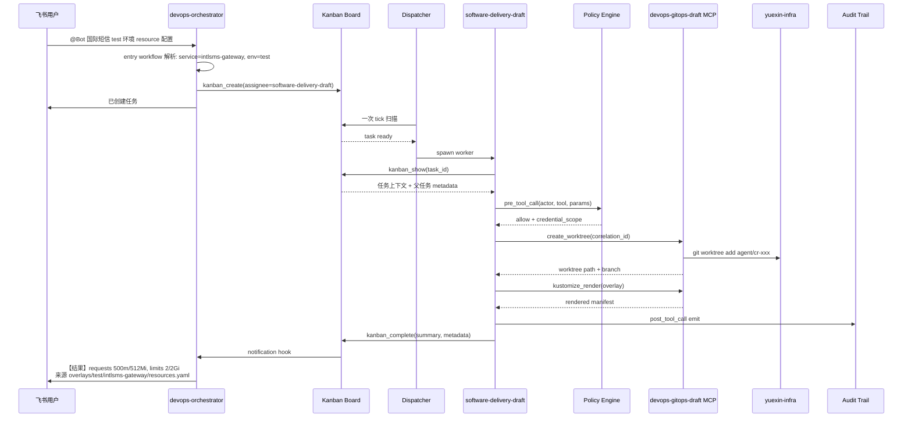

# Hermes DevOps Agent

---

## 全局视图

Hermes DevOps Agent 不是"加了运维工具的 Chatbot"，而是一个**把不可信的模型输出和高权限基础设施操作隔离开**的分布式系统。它的核心问题不是"模型能不能写脚本"，而是"出错时谁来兜底"。

整个系统拆成**六个互相协作但职责正交的平面**，每个平面有自己的强制层和失败模式：

```text
┌─────────────────────────────────────────────────────────────┐
│                   1. 入口层(Ingestion)                       │
│  飞书 ChatOps │ Webhook │ Schedules │ Alert │ Ticket / API   │
│  ChatOps → orchestrator;其他事件源 → 目标领域 profile        │
└────────────────────────────┬────────────────────────────────┘
                             │
┌────────────────────────────▼────────────────────────────────┐
│                   2. 路由调度(Routing)                       │
│  ChatOps:Orchestrator → Kanban Board → Dispatcher            │
│  事件驱动:直接进入领域 profile gateway,不经 Board            │
└────────────────────────────┬────────────────────────────────┘
                             │
┌────────────────────────────▼────────────────────────────────┐
│                3. Profile 运行时(Runtime)                    │
│  Distribution → Profile(config + SOUL + .env + workspace)    │
│  + Plugin(hooks / custom tools / slash commands)             │
│  隔离:入口、凭证、tools、MCP scope、memory、session          │
└────────────────────────────┬────────────────────────────────┘
                             │
┌────────────────────────────▼────────────────────────────────┐
│                 4. 能力体系(Capability)                      │
│  Skills: basics / tool_contracts / workflows / contexts      │
│  Subagents (领域隔离执行,delegate_task)                      │
└────────────────────────────┬────────────────────────────────┘
                             │
┌────────────────────────────▼────────────────────────────────┐
│                5. 工具集成(Integration)                      │
│  MCP Safe Wrappers (typed tools + schema + audit)            │
│  Hermes Tools / MCP Servers                                  │
│  Credential Broker (短 TTL 凭证) + Git Worktree 池           │
│  CLI / DSL / 配置规范由 basics skills 提供                    │
└────────────────────────────┬────────────────────────────────┘
                             │  ← 6 横切所有层
┌────────────────────────────▼────────────────────────────────┐
│                6. 治理与观测(Governance)                     │
│  Policy Hook │ Audit Trail │ Redaction                       │
│  Approval │ Break-glass │ Tier 0-4 自治分级                  │
│  DevOps Plugin (pre_tool_call / post_tool_call 等 hook)      │
└─────────────────────────────────────────────────────────────┘
```

- **1 → 5**：请求处理主链。每一步都是上一步的下游，职责正交。
- **6 横切 1-5**：治理与观测不是某一层的能力，而是每次 tool call 必经的关卡。

接下来按平面拆解。

---

## Plane 1: 入口层

外部事件如何进入系统。**不同信号源走不同接入路径**——飞书 ChatOps 经 orchestrator 统一路由，事件驱动信号（告警、Webhook、定时任务、工单）直接进入目标领域 profile，无需绕路。

| Signal Source | 接入 Profile | Example | Trigger Type |
|---|---|---|---|
| 飞书 ChatOps | `devops-orchestrator`（唯一需要意图解析的入口） | `@Bot 国际短信测试环境的 resource 配置是多少` | Interactive |
| Webhook | 目标领域 profile（按 webhook 来源） | Codeup MR opened、Jenkins build done | Event-driven |
| Schedules | 目标领域 profile | 每日 GitOps drift scan、巡检 | Time-driven |
| Alert Event | `observability`（直挂 webhook gateway） | Alertmanager / Grafana / 云监控 | Reactive |
| Ticket / API | 目标领域 profile | 工单系统、CI/CD 流水线触发 | Programmatic |


---

## Plane 2: 路由调度

两条入口路径架构上**独立**——Kanban 只服务于 ChatOps 跨 profile 路由，事件驱动信号直接由领域 profile 自治消化，不绕 Board。

```text
飞书 ChatOps           ──→  devops-orchestrator Gateway
                              │（解析意图 → 创建 Kanban 任务）
                              ▼
                          Kanban Board  ──→  Worker spawn
                                            （跨 profile 路由）

告警 / Webhook /        ──→  领域 profile gateway  ──→  profile 内部直接执行
定时任务 / Ticket          （结构化上下文，自治完成，不经 Board）
```

**两条路径的分工**：
- **ChatOps 路径（经 Kanban）**：自然语言 → orchestrator 解析意图 → `kanban_create(assignee=...)` → dispatcher spawn 目标 profile worker → `kanban_complete` → 回传飞书。Kanban 在这里解决"自然语言意图 → 哪个 profile 处理"的路由问题。
- **事件驱动路径（不经 Kanban）**：告警 / Webhook / Cron / Ticket → 领域 profile 自有 gateway → profile 内部完整执行 → 结果回传飞书 / 工单。信号已经路由到目的地，无需再绕 Board。

两条路径独立运行，但共用同一份 plugin 审计 hook，所有 tool call 都写入同一份 action trail。


### **ChatOps 路径（用户提供的例子）**

```text
  飞书群 @Bot → devops-orchestrator Gateway
    → orchestrator 解析意图（需要 LLM 解析自然语言）
    → kanban_create(assignee=software-delivery-draft, ...)
    → 飞书回复"已创建任务 #N"

  Dispatcher (15s tick) spawn software-delivery-draft:
    → kanban_show() 读取任务上下文
    → ...执行...
    → kanban_complete(summary, metadata)

  Gateway notification → 飞书群回传结果

  特征：异步、跨进程、有 15s 调度延迟、有 task 持久化、跨 profile 路由。
```

---

### 告警路径（事件驱动）

```text
Alertmanager webhook → observability profile 的 webhook gateway
  → entry workflow 解析（结构化 JSON,无需 LLM）:
        alert_name=IntlsmsHighErrorRate
        service=intlsms-gateway, env=prod
        severity=P1, error_rate=45%, window=5m
  → context / policy 校验:
        actor=alertmanager(system), scope=observe → allow
  → alert-triage workflow（profile 内部，同一进程）:
        ├─ prometheus_query(error_rate by route, 30m)
        ├─ loki_query("level=error", intlsms-gateway, 30m)
        └─ argocd_get_recent_syncs(intlsms-gateway, 1h)
  → observability-health-query workflow 聚合:
        503 突增,集中在 send_sms_v2 路由
        5min 前 ArgoCD sync 引入新版本
  → audit-trail 写入:
        correlation_id=alert_01HX..., result=success

profile 直接调用飞书 API → 故障群:
  "【P1】intlsms-gateway prod 错误率 45%
   疑似 5min 前 ArgoCD sync(send_sms_v2)引入
   证据 [audit_01HX...]"


```

特征：同步、单进程、亚秒延迟、无 task 持久化、profile 内自治。

### Orchestrator 的硬约束

**Orchestrator 是纯路由层**，遵循 `decompose, route, summarize — never execute`：

```yaml
# orchestrator config.yaml
kanban:
  dispatch_in_gateway: true
  dispatch_interval_seconds: 15
  max_in_progress_per_profile: 3
  failure_limit: 2
  auto_promote_children: true

custom_toolsets:
  orchestrator:
    - kanban
    - skills
    - memory
  # 不含 terminal / file / web / MCP 生产工具
```

---

## Plane 3: **Agent Runtime**

Profile 是**运行时状态隔离层**，不是安全沙箱。每个 profile 有独立 `HERMES_HOME`、`.env`、`SOUL`、`workspace`、`tool/MCP scope`。

```text
┌─────────────────────────────────────────────────────┐
│  Distribution  (Git 仓库交付包)                       │
│    distribution.yaml · SOUL.md · config.yaml         │
│    skills/ · cron/ · mcp.json                         │
│    交付完整 Agent，1:1 对应一个 profile               │
└──────────────────────┬──────────────────────────────┘
                       │ hermes profile install
                       ▼
┌─────────────────────────────────────────────────────┐
│  Profile  (运行时实例)                                │
│    gateway · workspace · credentials                │
│    skills  · MCP scope · memory/session             │
└──────────────────────┬──────────────────────────────┘
                       │ plugins.enabled
                       ▼
┌─────────────────────────────────────────────────────┐
│  Plugin  (能力扩展层)                                  │
│    custom tools · hooks · slash commands             │
│    pre_tool_call · post_tool_call · pre_gateway     │
└─────────────────────────────────────────────────────┘
```


###  profile + subagent的组合架构

1. devops-orchestrator

```
  Profile: devops-orchestrator
    ├── agentic-intent-parser
    │     └── 解析飞书自然语言：actor / service / env / request_type
    ├── agentic-task-router
    │     └── 选择目标 profile 并 kanban_create
    └── agentic-result-summarizer
          └── 汇总 worker 输出并回传飞书 / 故障群
```

2. infra-agent

```
  Profile: infra-agent
    ├── alicloud-analyst
    │     └── 阿里云 ECS / RDS / VPC / OSS / RAM 资源、容量、配额巡检
    ├── kubernetes-cluster-analyst
    │     └── ACK / K8s 集群、Pod、Service、Ingress 状态查询与诊断
    ├── network-analyst
    │     └── VPC / SLB / CEN / DNS 网络拓扑与连通性查询
    ├── alicloud-security-analyst
    │     └── RAM 权限、ActionTrail、暴露面合规检查
    └── alicloud-cost-analyst
          └── 成本分析、闲置资源识别、规格优化建议
```

3. CI/CD Pipeline

```
  Profile: gitops-agent
    ├── jenkins-pipeline
    │     └── Jenkins job / build / shared-library 查询与修改草稿
    ├── argocd
    │     └── ArgoCD app / sync / rollback 状态与已审批操作
    └── gitops
          └── Kustomize / Helm overlay 定位、render、base 与 overlay 对比
```

  4. observability 

```
  Profile: observability
    ├── prometheus-metrics-query
    │     └── Prometheus 指标查询、SLO 评估、告警来源溯源
    ├── loki-logs-query
    │     └── Loki 日志聚类、错误模式识别、关联分析
    ├── grafana
    │     └── Grafana dashboard、告警规则定位与可视化查询
    └── alert-router
          └── Alertmanager / Grafana / 云监控 webhook 接入、去重、聚合、补充上下文
```

---

## Plane 4: **Tools, CLIs & Skills**

这一层解决一个问题：**Agent 如何把运维请求变成可控、可审计、可复用的执行能力。**

Hermes skills 运行时是 flat namespace。当前方案不再维护多层 skill 目录，统一收敛为 4 类 skills。

```text
┌──────────────────────────────────────────────────────────────┐
│                  Skills 实现分类（仓库真实维护）               │
├──────────────────────────────────────────────────────────────┤
│ basics          基础工具知识：git / kubectl / kustomize / promql │
│ tool_contracts  工具安全契约：MCP、terminal、typed tool 调用边界 │
│ workflows       可复用流程：查询、诊断、巡检、MR 草稿、发布分析 │
│ contexts        业务上下文与治理：服务信息、仓库信息、审计脱敏  │
└──────────────────────────────────────────────────────────────┘
```

### 四类 skills 的职责

| 类别 | 放什么 | 不放什么 | 示例 |
|---|---|---|---|
| `basics` | CLI / DSL / 配置语法 | 业务服务名、生产权限 | `git-command-basics`、`kustomize-basics`、`promql-basics` |
| `tool_contracts` | MCP / terminal / typed tool 的允许动作、禁止动作、审计字段 | 业务流程编排 | `prometheus-query-tool`、`k8s-readonly-tool`、`git-command-workflow` |
| `workflows` | 可复用运维流程 | 写死单一业务服务 | `runtime-service-inspection`、`gitops-config-locate`、`kustomize-render` |
| `contexts` | 业务上下文、仓库上下文、治理规则 | tool 权限 | `intlsms-domain-context`、`yuexin-infra-domain-context`、`audit-trail` |

### 各类 skills 当前清单

清单以 `hermes-devops-agent/skills/catalog.yaml` 的 `categories` 为准（运行时真实维护的四类）。

| 类别 | 当前 skills |
|---|---|
| `basics` (12) | `git-command-basics`、`kustomize-basics`、`kubectl-basics`、`kubernetes-object-basics`、`jenkins-basics`、`argocd-basics`、`codeup-basics`、`promql-basics`、`loki-logql-basics`、`grafana-basics`、`alertmanager-basics`、`aliyun-basics` |
| `tool_contracts` (10) | `git-command-workflow`、`git-codeup-readonly-tool`、`jenkins-readonly-tool`、`argocd-query-tool`、`k8s-readonly-tool`、`prometheus-query-tool`、`loki-query-tool`、`aliyun-readonly-tool`、`release-gate-tool`、`release-executor-tool` |
| `workflows` (12) | `gitops-config-locate`、`kustomize-render`、`jenkins-library-inspect`、`release-impact-analyze`、`runtime-service-inspection`、`kubernetes-workload-diagnose`、`observability-health-query`、`scheduled-runtime-inspection`、`on-demand-runtime-inspection`、`gitops-mr-draft-orchestration`、`jenkins-change-orchestration`、`software-delivery-change-orchestration` |
| `contexts` (6) | `skill-policy-gate`、`audit-trail`、`secret-redaction`、`intlsms-domain-context`、`yuexin-infra-domain-context`、`jenkins-pipeline-domain-context` |

业务对象只进入 `contexts`（如国际短信信息放入 `intlsms-domain-context`）；`workflows` 保持通用，与不同 context 组合复用。

### 调用关系

最小执行链：profile 确定后，由 workflow 选流程、context 注入业务上下文、tool_contracts 调受控工具、basics 提供语法。

```text
用户请求
  ↓
profile 已经确定
  ↓
workflow 选择执行流程
  ↓
context 提供业务上下文
  ↓
tool_contracts 调用受控工具
  ↓
basic 提供命令 / DSL / 配置语法
  ↓
输出结果 + audit trail
```

四类 skills 在一次任务中是**纵向分层**协作的——entry 负责请求标准化，orchestration 负责编排，functional workflow 负责执行，context 负责业务上下文与治理，tool_contracts 负责受控工具，basics 负责语法：

```text
entry workflow          请求标准化（actor / service / env / request_type）
  ↓
orchestration workflow  编排子任务（fan-out / pipeline / human-in-the-loop）
  ↓
functional workflow     执行诊断 / 查询 / 巡检 / 草稿 / 发布分析
  ↓
context                 注入业务上下文 + 治理规则 + 脱敏要求
  ↓
tool_contracts          受控调用 MCP / terminal / typed tool
  ↓
basics                  提供命令 / DSL / 配置语法
  ↓
输出结果 + audit trail
```

Kanban 统一入口下，`devops-orchestrator` 只解析意图并建任务；worker profile 收到 task 后在自身 tool/MCP scope 内完成上述分层执行：

```text
飞书消息 → devops-orchestrator
  [chat-ops-entry workflow] 解析请求
  → kanban_create(assignee=<specialist>)

specialist worker spawn:
  [skill-policy-gate context] 校验 actor / scope
  [orchestration workflow]    编排子任务
  [functional workflow]       执行诊断 / 查询
  [tool_contracts]            调用 MCP / terminal / typed tool
  [basics]                    提供语法知识
  → kanban_complete(summary, metadata)
```

### 示例：查询国际短信 gateway 测试环境配置

```text
用户请求：
  当前国际短信 gateway 测试环境 resource 配置是多少

执行链路：
  gitops-agent profile
    → gitops-config-locate
    → intlsms-domain-context / yuexin-infra-domain-context
    → git-command-workflow
    → git-command-basics / kustomize-basics
    → kustomize-render

输出：
  最终生效 resource 配置
  来源文件
  渲染依据
  审计记录
```

### 目录标准与 Distribution 同步

Hermes skills 原生是 flat namespace，**实施目录不按分类拆物理目录**——分类只活在 `catalog.yaml`，落盘是每个 skill 一个独立目录：

```text
skills/
  <skill-name>/
    SKILL.md
    references/   # 可选，仅放真实可复用参考资料
    examples/     # 可选，仅放真实业务 / 工程示例
    scripts/      # 可选，仅放可执行、可验证的辅助脚本
```

`skills/` 是**唯一源码层**，installable distribution 里的 `skills/devops/` 是它的**同构镜像副本**，不维护第二套手写结构。改完 shared skills 必须覆盖同步到 distribution 再跑 validator：

```text
skills/                                  # 源码层（唯一真源）
  └─ 覆盖同步 →
distributions/<profile>/skills/devops/   # 安装层镜像副本
```

> `gitops-agent` distribution 例外排除 `git-workspace-draft-tool`：它的 Git clone/fetch/pull/commit/push 走 direct Git CLI，不经 MCP draft 工具。

### 落地规则

| 规则 | 执行口径 |
|---|---|
| skills 目录 | `skills/<skill-name>/SKILL.md`（flat namespace，详见上「目录标准」） |
| catalog | 只维护 `basics`、`tool_contracts`、`workflows`、`contexts` |
| 业务对象 | 只放到 `contexts` |
| 通用流程 | 放到 `workflows`，通过不同 context 复用 |
| 权限 | 不由 skill 授权，由 profile + MCP scope + policy hook 控制 |

---

## Plane 5: MCP

模型不直接持有凭证、不接触原始 shell、不写共享 checkout。所有外部副作用通过**三个隔离层**进入真实系统。

| 优先级 | MCP Server          | 主要能力                                     | 权限风险 |
| ------ | ------------------- | -------------------------------------------- | -------- |
| P0     | Kubernetes MCP      | 查询 Pod、Deployment、Node、Event、Namespace | read-only / gated-write |
| P0     | Prometheus MCP      | 查询指标、告警、SLO、时间序列                | read-only |
| P0     | Loki / 日志 MCP     | 查询错误日志、按 Trace / Pod / 服务过滤      | read-only |
| P0     | ArgoCD MCP          | 查询应用同步状态、Diff、历史版本、回滚建议   | read-only / gated-sync |
| P1     | Jenkins MCP         | 查询构建记录、失败日志、流水线状态           | read-only / gated-build |
| P1     | Git / Codeup MCP    | 查询提交、分支、配置差异、变更历史           | read-only / draft |
| P1     | 云厂商 MCP          | 查询 ECS、SLB、ACK、RDS、账单、资源状态      | read-only / gated-change |
| P1     | CMDB / 服务目录 MCP | 查询服务负责人、依赖、环境、SLA              | read-only |
| P1     | 工单 / 审批 MCP     | 创建变更单、查询审批状态、记录执行结果       | governance-write |

根据不同的环境注册程度MCP格式如下：

```
prometheus-intlsms-prod
prometheus-intlsms-test
loki-intlsms-prod
loki-intlsms-test
k8s-intlsms-prod
k8s-intlsms-test
```

**Tool 命名规则**：Hermes 运行时把 MCP tool 注册为 `mcp_<server>_<tool>`（dashes→underscores）。

```yaml
# observability-query profile config.yaml
mcp_servers:
  k8s-intlsms-test:
    command: "python3"
    args: ["mcp-servers/k8s/server.py"]
    tools:
      include:
        - k8s_readonly_get_workload

```

## 6. Plugin 体系：不改 core 的能力扩展

### 6.1 Plugin 职责

当前 `plugins/devops_agent/` 已不再只是预留目录。仓库中已有 `plugin.yaml`、`__init__.py`、`policy.py`、`audit.py`、`redaction.py`、`guardrails.py`、`kanban_reply.py` 和 `commands.py`。`plugin.yaml` 版本为 `0.4.0`，声明了 NeMo Guardrails input rail、policy gate、audit trail、secret redaction、Kanban 到飞书回传订阅、治理工具、slash commands 和 CLI command。

注册面以 `plugins/devops_agent/__init__.py` 为准：

```python
def register(ctx):
    ctx.register_hook("pre_gateway_dispatch",  _guardrails.pre_gateway_dispatch)
    ctx.register_hook("pre_tool_call",         _pre_tool_call)
    ctx.register_hook("post_tool_call",        _post_tool_call)
    ctx.register_hook("transform_tool_result", _transform_tool_result)

    ctx.register_tool("devops_policy_decide", toolset="devops_governance", ...)
    ctx.register_tool("devops_audit_emit",    toolset="devops_governance", ...)

    ctx.register_command("devops_status", ...)
    ctx.register_command("devops_audit", ...)
    ctx.register_cli_command(name="devops", ...)
```

### 6.2 Plugin 能力清单

| 能力 | 当前实现文件 | 作用 | 当前状态 |
|---|---|---|---|
| Input rail | `guardrails.py` + `pre_gateway_dispatch` | 飞书消息进入 worker 前做 jailbreak / prompt injection 初筛 | 已有代码，需运行时联调 |
| Policy gate | `policy.py` + `pre_tool_call` | 对工具名中的生产写模式进行拦截；非 `governance-breakglass` profile 不允许调用匹配的生产写工具 | 已有代码，需验证 hook 阻断语义 |
| Audit trail | `audit.py` + `post_tool_call` | 写结构化 action trail | 已有代码，需验证运行时日志路径和回放 |
| Redaction | `redaction.py` + `transform_tool_result` | 脱敏 tool output，防止 secret 进入模型上下文 | 已有代码，需补样例测试 |
| Kanban 回传订阅 | `kanban_reply.py` + `post_tool_call(kanban_create)` | 解析 task body 中的 `reply_target`，写入 Kanban notify subscription | 已有代码，需飞书端 smoke |
| Governance tools | `devops_policy_decide`、`devops_audit_emit` | 显式策略检查和手工审计事件 | 已注册 |
| Slash / CLI | `commands.py` | `/devops_status`、`/devops_audit`、`hermes devops ...` | 已有代码，需本机 CLI 验证 |

### 6.3 硬性约束

**插件不得修改 Hermes core**。如果框架能力不足，先新增通用 plugin surface，再让 DevOps plugin 使用该 surface。

---


## Putting It Together: End-to-End Flow

**以下展示 ChatOps 路径**：飞书查询 → Orchestrator 路由 → Kanban 分派 → Worker 执行 → 结果回传。事件驱动路径（告警 / Webhook / Cron / Ticket）不走这条链——由领域 profile gateway 直接消化，参见 Plane 1 / Plane 2。



### 时序关键点

- **entry workflow 不切换 profile**——只输出标准化请求结构。
- **Worker spawn 后才进入 policy gate**——orchestrator 不持有任何 MCP 生产工具。
- **每个 tool call 都经过 pre/post hook**——审计闭环必须能不读聊天记录还原 run。
- **事件驱动信号不走这条链**——告警 / Webhook / Cron / Ticket 直接进入领域 profile gateway，policy gate / MCP call / audit emit 全部在 profile 内部完成，结果回传飞书 / 工单。
- **生产紧急动作也不走这条链**——走独立 `governance-breakglass` Gateway，独立飞书 Bot + 独立凭证。

---
