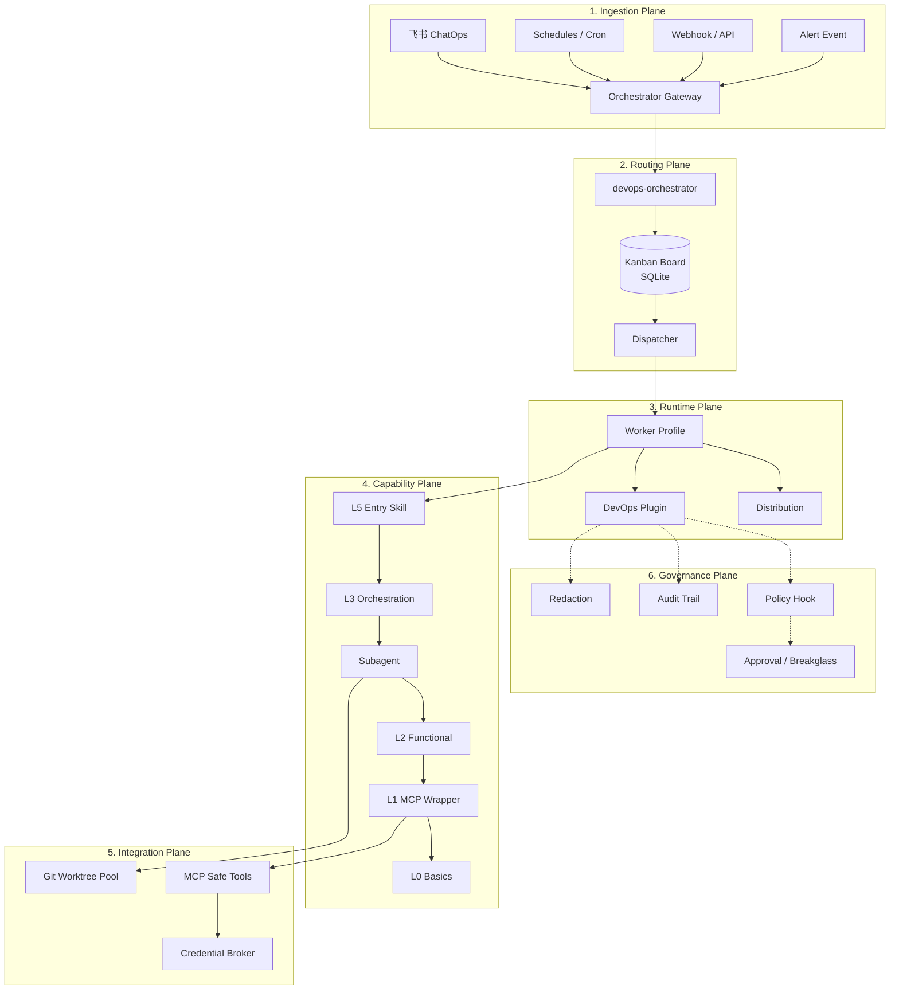
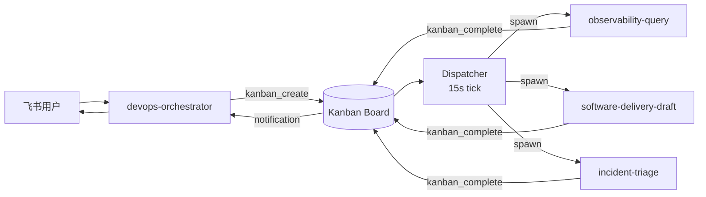
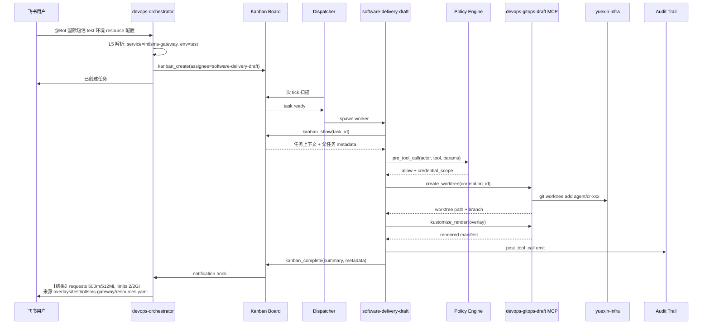

# Chapter 14: Hermes DevOps Agent 架构汇报

> 一份可治理的 DevOps 运维 Agent 平台：六个平面、五个领域 Agent、十五个 Profile。

---

## The Big Picture

Hermes DevOps Agent 不是"加了运维工具的 Chatbot"，而是一个**把不可信的模型输出和高权限基础设施操作隔离开**的分布式系统。它的核心问题不是"模型能不能写脚本"，而是"出错时谁来兜底"。

整个系统拆成**六个互相协作但职责正交的平面**，每个平面有自己的强制层和失败模式：



接下来按平面拆解。

---

## Plane 1: Ingestion（入口层）

外部事件如何进入系统。所有信号最终归一为同一个 Kanban Task 结构。

| Signal Source | Example | Trigger Type |
|--------------|---------|-------------|
| 飞书群消息 | `@Bot 国际短信测试环境的 resource 配置是多少` | Interactive |
| Webhook | Jenkins构建优化 | Event-driven |
| Schedules | 定时巡检 | Time-driven |
| Alert Event | Alertmanager / Grafana / 云监控 | Reactive |
| Ticket / API | 工单系统、CI/CD 流水线触发 | Programmatic |

### 架构模式：单一接入点 + 紧急通道隔离

```text
所有普通入口  ──→  devops-orchestrator Gateway（单一飞书 Bot）
                       │
                       ▼
                   Kanban Board

生产紧急动作  ──→  governance-breakglass Gateway（独立飞书 Bot）
                       │
                       ▼
                  独立审批 + 短 TTL 凭证
```

**关键约束**：`governance-breakglass` 永远不经过 orchestrator，避免普通入口被滥用扩权。

### Ingestion 替代方案

| 方案 | 适用 | 风险 |
|------|------|------|
| **单一 orchestrator Gateway**（本方案） | 飞书 Bot 集中管理、易审计 | orchestrator 故障影响所有入口 |
| Per-profile Gateway | 入口物理隔离 | 多飞书 Bot 难管理，需外部 router |
| API Gateway + Lambda | 无服务器扩缩 | 冷启动、本地调试复杂 |

---

## Plane 2: Routing（统一入口与多 Agent 调度）

请求进入后**不直接执行**——orchestrator 解析意图、创建 Kanban Task、由 dispatcher 异步分派给 worker。

### 核心架构



### Orchestrator 的硬约束

**Orchestrator 是纯路由层**，遵循 `decompose, route, summarize — never execute`：

```yaml
# orchestrator config.yaml
kanban:
  dispatch_in_gateway: true
  dispatch_interval_seconds: 15
  max_in_progress_per_profile: 3
  failure_limit: 2
  auto_promote_children: true

custom_toolsets:
  orchestrator:
    - kanban
    - skills
    - memory
  # 不含 terminal / file / web / MCP 生产工具
```

### Kanban vs per-profile Gateway

| 能力 | per-profile Gateway | Kanban 统一入口（本方案） |
|---|---|---|
| 飞书 Bot 数量 | 多 Bot 或外部 router | 单一 Bot |
| 持久化 | session（crash 丢失） | SQLite-backed task board |
| 并发控制 | 无原生机制 | `max_in_progress_per_profile` |
| 多步编排 | L3 skill + delegate_task | `parents` 依赖图 + 自动 promote |
| 审批 | 自建 approval_check | `kanban_block` → 人工 unblock |
| 失败恢复 | 自建 retry | Dispatcher 自动重试 + 断路器 |

### 紧急请求的混合策略

```text
飞书请求 → orchestrator 判断紧急程度
  ├─ 普通查询    → kanban_create → dispatcher → worker → 回传
  └─ 紧急诊断    → delegate_task 即时响应 + kanban_create 做审计
```

紧急判定依据：来自告警群 / 包含"故障"/"P0" 关键词。

---

## Plane 3: Runtime（Profile + Distribution + Plugin）

Profile 是**运行时状态隔离层**，不是安全沙箱。每个 profile 有独立 `HERMES_HOME`、`.env`、SOUL、workspace、tool/MCP scope。

### 三件套职责

```text
┌─────────────────────────────────────────────────────┐
│  Distribution  (Git 仓库交付包)                       │
│    distribution.yaml · SOUL.md · config.yaml         │
│    skills/ · cron/ · mcp.json                         │
│    交付完整 Agent，1:1 对应一个 profile               │
└──────────────────────┬──────────────────────────────┘
                       │ hermes profile install
                       ▼
┌─────────────────────────────────────────────────────┐
│  Profile  (运行时实例)                                 │
│    gateway · workspace · credentials                  │
│    skills allowlist · MCP scope · memory/session     │
└──────────────────────┬──────────────────────────────┘
                       │ plugins.enabled
                       ▼
┌─────────────────────────────────────────────────────┐
│  Plugin  (能力扩展层)                                  │
│    custom tools · hooks · slash commands             │
│    pre_tool_call · post_tool_call · pre_gateway     │
└─────────────────────────────────────────────────────┘
```

### 十五个 Profile 一览

| 领域 Agent | Profile | 默认能力 | tool / MCP 边界 |
|---|---|---|---|
| Orchestrator | `devops-orchestrator` | route / decompose | kanban + skills |
| Cloud Infrastructure | `cloud-infra-readonly` | observe | Kubernetes / 阿里云 read-only |
| Cloud Infrastructure | `cloud-infra-diagnosis` | observe / recommend | + Prometheus / Loki |
| Cloud Infrastructure | `cloud-infra-change-gated` | gated change | + 已审批平台变更 |
| Software Delivery | `software-delivery-readonly` | observe | Jenkins / ArgoCD / GitOps read-only |
| Software Delivery | `software-delivery-draft` | draft | + Git worktree / Kustomize / MR draft |
| Software Delivery | `software-delivery-release-gated` | release gated | + Jenkins/ArgoCD sync gated |
| Observability | `observability-query` | observe | Prometheus / Loki / Grafana read-only |
| Observability | `observability-alert-intake` | observe | + 告警事件接入 |
| Incident Response | `incident-intake` | observe | 入口标准化 |
| Incident Response | `incident-triage` | observe / recommend | 多系统只读关联 |
| Incident Response | `incident-commander` | coordinate | 时间线 / 通知 / 复盘 |
| Data Infrastructure | `data-infra-readonly` | observe | Redis / PostgreSQL 只读诊断 |
| Data Infrastructure | `data-infra-change-gated` | gated change | + 已审批参数 / 连接变更 |
| Governance | `governance-admin` | manage | 配置 / 审计查询 |
| Governance | `governance-breakglass` | production gated | 一次审批一个动作 |

### Profile 的关键约束

| 强制层 | 机制 | 强制性 |
|---|---|---|
| MCP tool filter | `config.yaml` → `mcp_servers.<server>.tools.include/exclude` | 硬限制 |
| MCP server 内部校验 | tool handler 校验 actor / scope / credential | 硬限制 |
| Plugin `pre_tool_call` hook | 执行前 policy 校验 | 待验证（Phase 1 前需测） |
| `terminal.cwd` | 限制终端起始目录 | 软限制 |

> **Profile 不是沙箱**。安全强制层靠 MCP filter + plugin hook + credential broker 组合实现。

---

## Plane 4: Capability（L0-L5 Skills + Subagents）

把"模型应该会什么"按粒度拆成六层。**分层不是授权机制**——权限仍由 profile toolset + MCP filter + policy hook 控制。

### 分层模型

```text
┌──────────────────────────────────────────────────────────────┐
│ L5  Entry Skills          请求标准化（actor/service/env/route）│
│ ──────────────────────────────────────────────────────────── │
│ L4  Domain Governance     policy / audit / redaction          │
│ ──────────────────────────────────────────────────────────── │
│ L3  Orchestration         场景编排：选 L2、委派 subagent       │
│ ──────────────────────────────────────────────────────────── │
│ L2  Functional Skills     单一运维能力（诊断/查询/定位）         │
│ ──────────────────────────────────────────────────────────── │
│ L1  MCP Safe Wrappers     typed schema + allow/deny + audit  │
│ ──────────────────────────────────────────────────────────── │
│ L0  Basics                CLI/DSL/配置语法                     │
└──────────────────────────────────────────────────────────────┘
```

### Kanban 模式下的两阶段执行

```text
飞书消息 → devops-orchestrator
  [L5 chat-ops-entry] 解析请求
  → kanban_create(assignee=<specialist>)

specialist worker spawn:
  [L4 skill-policy-gate]      校验 actor/scope
  [L3 orchestration]          编排子任务
  [L2 functional]             执行诊断/查询
  [L1 MCP wrapper]            调用 tool
  [L0 basics]                 提供语法知识
  → kanban_complete(summary, metadata)
```

### Subagent 调用契约

Hermes 官方 subagent 通过 `delegate_task` 运行时创建，**不支持声明式 YAML spec**。`subagents/*.yaml` 是设计规约文档。

```python
delegate_task(
  goal="查询国际短信服务的 SLO、错误率、日志聚类",
  context="actor=ou_sre_1, service=intlsms, environment=prod, correlation_id=cr-xxx",
  toolsets=["mcp-devops-observe"],
  max_iterations=20,
)
```

**Leaf subagent 硬禁止 toolsets**：`delegation` / `clarify` / `memory` / `code_execution` / `send_message`。

| Subagent | 处理内容 | 允许 toolsets |
|---|---|---|
| `observability-agent` | 指标、日志、Grafana 诊断 | `["mcp-devops-observe"]` |
| `kubernetes-agent` | Kubernetes 状态、资源、事件 | `["mcp-devops-observe"]` |
| `gitops-agent` | 配置定位、渲染、MR 草稿 | `["terminal", "file", "mcp-devops-gitops-draft"]` |
| `release-agent` | Jenkins / ArgoCD 发布诊断 | `["mcp-devops-observe"]` |
| `datastore-agent` | Redis / PostgreSQL 诊断 | `["mcp-devops-data-observe"]` |
| `governance-reviewer` | 权限、审批、审计复核 | `["mcp-devops-governance"]` |

---

## Plane 5: Integration（MCP + Worktree + Credentials）

模型不直接持有凭证、不接触原始 shell、不写共享 checkout。所有外部副作用通过**三个隔离层**进入真实系统。

### MCP Safe Tools

| MCP Server | 运行时 toolset | 工具范围 | 默认权限 |
|---|---|---|---|
| `devops-observe` | `mcp-devops-observe` | Prometheus / Loki / K8s / ArgoCD / Jenkins 只读 | Observe |
| `devops-gitops-draft` | `mcp-devops-gitops-draft` | Git branch / Kustomize render / MR draft | Draft |
| `devops-data-observe` | `mcp-devops-data-observe` | Redis / PostgreSQL 诊断 | Observe |
| `devops-governance` | `mcp-devops-governance` | policy / approval / audit / redaction | Governance |
| `devops-prod-breakglass` | `mcp-devops-prod-breakglass` | 已审批生产动作 | Production gated |

**Tool 命名规则**：Hermes 运行时把 MCP tool 注册为 `mcp_<server>_<tool>`（dashes→underscores）。

```yaml
# observability-query profile config.yaml
mcp_servers:
  devops-observe:
    command: "python3"
    args: ["mcp-servers/devops-observe/devops_observe_mcp.py"]
    tools:
      include:
        - prometheus_query
        - loki_query
        - k8s_readonly_get_workload
  # devops-prod-breakglass 不在此 profile 配置 → 该 toolset 不存在
```

### Git Worktree 池

`software-delivery-draft` 用 profile-owned workspace 隔离并发 GitOps 任务：

```text
~/.hermes/profiles/software-delivery-draft/workspace/
  yuexin-infra.git/                       # bare / mirror repo
  worktrees/
    cr-<correlation_id>-<short_task>/
      .git
      deploy/
      overlays/
      render-output/
      .hermes-task.json                   # actor/profile/branch/audit metadata
  reports/
  cleanup/
```

清理规则：MR 合并/关闭后清理；render 失败保留 24-72h 排查；无变更立即清理。

### Credential Broker

| 凭证类型 | 存放 | 读取方式 |
|---|---|---|
| 飞书 / LLM provider key | profile `.env` | gateway 启动时读 |
| DevOps 只读系统凭证 | Bitwarden | MCP server 按 scope 读 |
| 生产 break-glass 凭证 | credential broker + approval record | 一次审批一个动作，短 TTL |
| 阿里云 RAM | Bitwarden 保存根材料，运行时换 STS | tool 只拿 STS |

**关键约束**：运行时 credential broker 非 Hermes 原生能力，需自建为独立 MCP server 或集成在 `devops-governance`。返回给模型的不是原始 secret，而是引用：

```json
{
  "credential_ref": "cred_01HX...",
  "scope": {
    "profile": "observability-query",
    "environment": "prod",
    "system": "prometheus",
    "actions": ["query_range"],
    "ttl_seconds": 900
  },
  "audit_id": "audit_01HX..."
}
```

---

## Plane 6: Governance（治理与观测）

每一次 tool call 都必须经过**策略判断 + 凭证签发 + 审计落盘 + 输出脱敏**四道关卡。Agent 行为的可观测性要求**比人类操作员更高**，因为推理过程不可见。

### 四道关卡

| 关卡 | 实现 | 失败模式 |
|---|---|---|
| **Policy Gate** | `pre_tool_call` hook + `devops_policy_decide` | 未授权动作 fail closed |
| **Credential Broker** | 独立 MCP server，policy 通过后签发 | 无 policy decision 时拒绝签发 |
| **Audit Trail** | `post_tool_call` hook + `devops_audit_emit` | 必须能不读聊天记录还原 run |
| **Redaction** | output hook / tool wrapper | secret 不进入模型上下文和回复 |

### 自治等级矩阵

| 等级 | 名称 | Agent 能力 | 典型工具 |
|---|---|---|---|
| 0 | Observe | 只读查询和总结 | Prometheus query / kubectl get |
| 1 | Recommend | 输出诊断、runbook 和风险 | + 结构化报告生成 |
| 2 | Draft | 创建分支、编辑 GitOps、准备 MR | Git / Kustomize / policy check |
| 3 | Non-prod execute | 重启非生产、审批后 sync 非生产 | Project-scoped ArgoCD / namespace K8s |
| 4 | Production gated | 命名审批 + 工单 + 审计的生产变更 | 独立 SA + 短 TTL token + 一次审批一动作 |

### 审计事件 Schema

```typescript
interface AuditEvent {
  correlation_id: string;
  actor: string;              // ou_xxx 飞书 open_id
  profile: string;            // observability-query
  service: string;            // intlsms-gateway
  environment: 'test' | 'prod';
  tool: string;               // mcp_devops_observe_prometheus_query
  resource: string;           // 查询的 metric/namespace/repo
  policy_decision: 'allow' | 'deny';
  credential_ref?: string;
  result: 'success' | 'failure' | 'blocked';
  duration_ms: number;
  error?: string;
}
```

---

## Putting It Together: End-to-End Flow

完整流程：飞书查询 → Orchestrator 路由 → Kanban 分派 → Worker 执行 → 结果回传。



### 时序关键点

- **L5 不切换 profile**——只输出标准化请求结构。
- **Worker spawn 后才进入 policy gate**——orchestrator 不持有任何 MCP 生产工具。
- **每个 tool call 都经过 pre/post hook**——审计闭环必须能不读聊天记录还原 run。
- **生产紧急动作不走这条链**——走独立 `governance-breakglass` Gateway。

---

## 落地状态与下一步

| Phase | 关键交付 | 状态 |
|---|---|---|
| Phase 0 | 官方事实锁定、服务盘点、权限基线 | 进行中 |
| Phase 1 | Distribution 仓库、DevOps plugin、Profile、飞书接入、MCP 只读、密钥维护、Git worktree | 部分进行中 |
| Phase 2 | 场景回放、审计闭环 | 待启动 |
| Phase 3 | 非生产动作开放 | 待启动 |
| Phase 4 | 生产 break-glass | 待启动 |

### 当前 Phase 1 已落地

- `hermes-devops-agent/skills/` 的 L0/L1/L2/L3/L4/L5 第一阶段 skills（`observability-query` 入口）
- `distributions/observability-query/` 安装结构 + validator
- skill catalog 校验脚本（`tests/validate_skills_catalog.py`）

### 待确认问题

| 问题 | 停止条件 |
|---|---|
| `pre_tool_call` hook 是否能阻断 tool 执行 | 最小验证 plugin 测试通过，确认阻断或备选方案 |
| 飞书 `group_rules` 是否匹配官方 adapter | 验证 adapter config 或落地 `pre_gateway_dispatch` hook |
| Credential broker 实现方式 | 短 TTL credential 签发与验证通过 |
| 审批系统接口 | breakglass 前必须有 approval_check tool |
| Action trail 存储 | audit replay test 可从结构化日志还原 run |

---

## 上线红线

- Distribution 安装 / 更新不覆盖 `.env`、memories、sessions、API keys。
- DevOps plugin 可装可卸，**未修改 Hermes core**。
- 普通 profile 的 tool list **不出现** `devops-prod-breakglass:*`。
- 生产变更必须有命名审批人 + 工单 + 短 TTL 凭证 + audit trail。
- 模型上下文 / 用户回复中**永不出现**长期 cloud / K8s / DB / Jenkins / Grafana / ArgoCD secret。
- 至少 3 个代表服务的只读诊断、GitOps 查询、资源定位通过回放测试。
- GitOps draft 在创建 MR 前完成 render + validate。
- Prompt injection 测试 fail closed。
- 审计人员不看聊天记录也能从结构化日志还原一次 run。

---

## 附录：原始落地方案

完整章节、距 14 章原文每一条决策的官方依据、22 轮批判审计，详见 [`14-hermes-agent-devops-implementation.md`](../../14-hermes-agent-devops-implementation.md)。

本汇报文档为该方案的**架构平面视角投影**，用于评审和管理层沟通；不替代落地手册。
